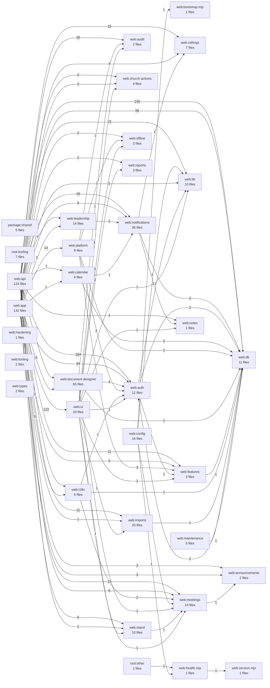

# Code Dependency Graph

> Generated by `npm run docs:dependencies`. Do not edit generated tables or diagrams by hand.

This index statically scans JavaScript and TypeScript imports. It groups files into architectural areas so the graph remains readable, while the file index preserves per-file dependency counts. Dynamic imports with non-literal paths, runtime database relationships, SQL dependencies, framework routing, and infrastructure configuration are outside its scope.

## Architectural graph

An arrow means that the source area imports the target area. Labels are the number of import statements (not necessarily unique files). Self-references are omitted from the diagram and retained in the table below.

## Area inventory

| Area | Source files |
| --- | ---: |
| `package:shared` | 5 |
| `root:other` | 1 |
| `root:tooling` | 7 |
| `web:announcements` | 2 |
| `web:api` | 124 |
| `web:app` | 142 |
| `web:audit` | 2 |
| `web:auth` | 12 |
| `web:bootstrap.mjs` | 1 |
| `web:calendar` | 4 |
| `web:callings` | 7 |
| `web:church-actions` | 4 |
| `web:config` | 16 |
| `web:db` | 11 |
| `web:document-designer` | 65 |
| `web:features` | 3 |
| `web:hardening` | 1 |
| `web:health.mjs` | 1 |
| `web:i18n` | 5 |
| `web:imports` | 20 |
| `web:leadership` | 14 |
| `web:lib` | 10 |
| `web:maintenance` | 5 |
| `web:meetings` | 14 |
| `web:notes` | 1 |
| `web:notifications` | 36 |
| `web:offline` | 3 |
| `web:platform` | 9 |
| `web:reports` | 3 |
| `web:stand` | 10 |
| `web:tooling` | 2 |
| `web:types` | 2 |
| `web:ui` | 33 |
| `web:version.mjs` | 1 |

## Internal dependencies

| Importing area | Imported area | Imports |
| --- | --- | ---: |
| `web:document-designer` | `web:document-designer` | 174 |
| `web:api` | `web:auth` | 164 |
| `web:api` | `web:db` | 145 |
| `web:app` | `web:ui` | 123 |
| `web:app` | `web:auth` | 94 |
| `web:app` | `web:app` | 69 |
| `web:app` | `web:db` | 56 |
| `web:api` | `web:document-designer` | 53 |
| `web:notifications` | `web:notifications` | 53 |
| `web:api` | `web:notifications` | 46 |
| `web:api` | `web:api` | 33 |
| `web:api` | `web:audit` | 30 |
| `web:ui` | `web:ui` | 30 |
| `web:api` | `web:lib` | 23 |
| `web:platform` | `web:platform` | 17 |
| `web:api` | `web:callings` | 15 |
| `web:app` | `web:document-designer` | 15 |
| `web:app` | `web:meetings` | 15 |
| `web:app` | `web:platform` | 14 |
| `web:imports` | `web:imports` | 14 |
| `web:meetings` | `web:meetings` | 12 |
| `web:api` | `web:features` | 11 |
| `web:api` | `web:imports` | 11 |
| `web:app` | `web:notifications` | 8 |
| `web:auth` | `web:auth` | 8 |
| `web:leadership` | `web:leadership` | 8 |
| `web:stand` | `web:stand` | 8 |
| `web:api` | `web:leadership` | 7 |
| `web:api` | `web:meetings` | 6 |
| `web:app` | `web:features` | 5 |
| `web:app` | `web:stand` | 5 |
| `web:app` | `web:callings` | 4 |
| `web:callings` | `web:callings` | 4 |
| `web:db` | `web:db` | 4 |
| `web:document-designer` | `web:auth` | 4 |
| `web:features` | `web:features` | 4 |
| `web:i18n` | `web:i18n` | 4 |
| `web:lib` | `web:lib` | 4 |
| `web:api` | `web:announcements` | 3 |
| `web:api` | `web:i18n` | 3 |
| `web:app` | `web:announcements` | 3 |
| `web:app` | `web:i18n` | 3 |
| `web:app` | `web:leadership` | 3 |
| `web:calendar` | `web:calendar` | 3 |
| `web:maintenance` | `web:maintenance` | 3 |
| `web:notifications` | `web:db` | 3 |
| `web:platform` | `web:auth` | 3 |
| `web:platform` | `web:features` | 3 |
| `package:shared` | `package:shared` | 2 |
| `web:api` | `web:church-actions` | 2 |
| `web:app` | `web:church-actions` | 2 |
| `web:app` | `web:offline` | 2 |
| `web:app` | `web:reports` | 2 |
| `web:auth` | `web:db` | 2 |
| `web:calendar` | `web:db` | 2 |
| `web:church-actions` | `web:church-actions` | 2 |
| `web:config` | `web:lib` | 2 |
| `web:db` | `web:auth` | 2 |
| `web:i18n` | `web:meetings` | 2 |
| `web:leadership` | `web:notifications` | 2 |
| `web:platform` | `web:audit` | 2 |
| `web:platform` | `web:db` | 2 |
| `web:ui` | `web:reports` | 2 |
| `root:other` | `web:health.mjs` | 1 |
| `web:announcements` | `web:announcements` | 1 |
| `web:api` | `web:calendar` | 1 |
| `web:api` | `web:notes` | 1 |
| `web:api` | `web:stand` | 1 |
| `web:app` | `web:calendar` | 1 |
| `web:app` | `web:imports` | 1 |
| `web:app` | `web:lib` | 1 |
| `web:audit` | `web:audit` | 1 |
| `web:auth` | `web:features` | 1 |
| `web:auth` | `web:lib` | 1 |
| `web:calendar` | `web:notifications` | 1 |
| `web:config` | `web:bootstrap.mjs` | 1 |
| `web:config` | `web:health.mjs` | 1 |
| `web:config` | `web:meetings` | 1 |
| `web:document-designer` | `web:audit` | 1 |
| `web:document-designer` | `web:db` | 1 |
| `web:document-designer` | `web:meetings` | 1 |
| `web:features` | `web:db` | 1 |
| `web:health.mjs` | `web:version.mjs` | 1 |
| `web:i18n` | `web:auth` | 1 |
| `web:i18n` | `web:db` | 1 |
| `web:imports` | `web:db` | 1 |
| `web:maintenance` | `web:db` | 1 |
| `web:meetings` | `web:announcements` | 1 |
| `web:notifications` | `web:callings` | 1 |
| `web:notifications` | `web:notes` | 1 |
| `web:offline` | `web:offline` | 1 |
| `web:platform` | `web:offline` | 1 |
| `web:reports` | `web:reports` | 1 |
| `web:stand` | `web:meetings` | 1 |
| `web:ui` | `web:auth` | 1 |
| `web:ui` | `web:church-actions` | 1 |
| `web:ui` | `web:features` | 1 |
| `web:ui` | `web:imports` | 1 |
| `web:ui` | `web:lib` | 1 |
| `web:ui` | `web:meetings` | 1 |
| `web:ui` | `web:notes` | 1 |
| `web:ui` | `web:offline` | 1 |
| `web:ui` | `web:stand` | 1 |

## External dependencies

| Importing area | Package/runtime | Imports |
| --- | --- | ---: |
| `web:app` | `next` | 103 |
| `web:api` | `next` | 82 |
| `web:app` | `react` | 44 |
| `web:ui` | `react` | 31 |
| `web:api` | `vitest` | 30 |
| `web:document-designer` | `vitest` | 24 |
| `web:app` | `vitest` | 20 |
| `web:app` | `next-intl` | 19 |
| `web:notifications` | `vitest` | 16 |
| `web:api` | `zod` | 15 |
| `root:tooling` | `Node.js` | 14 |
| `web:app` | `@testing-library/react` | 14 |
| `web:ui` | `next` | 14 |
| `web:notifications` | `pg` | 13 |
| `web:document-designer` | `zod` | 10 |
| `web:db` | `Node.js` | 9 |
| `web:ui` | `next-intl` | 9 |
| `web:db` | `vitest` | 7 |
| `web:document-designer` | `Node.js` | 7 |
| `web:imports` | `vitest` | 7 |
| `web:meetings` | `vitest` | 7 |
| `web:auth` | `next-auth` | 6 |
| `web:leadership` | `vitest` | 6 |
| `web:ui` | `@testing-library/react` | 6 |
| `web:ui` | `vitest` | 6 |
| `web:auth` | `vitest` | 5 |
| `web:config` | `@playwright/test` | 5 |
| `web:stand` | `vitest` | 5 |
| `web:app` | `@testing-library/user-event` | 4 |
| `web:tooling` | `Node.js` | 4 |
| `web:ui` | `next-auth` | 4 |
| `web:api` | `Node.js` | 3 |
| `web:app` | `Node.js` | 3 |
| `web:app` | `next-auth` | 3 |
| `web:callings` | `vitest` | 3 |
| `web:db` | `drizzle-orm` | 3 |
| `web:lib` | `vitest` | 3 |
| `package:shared` | `vitest` | 2 |
| `root:other` | `Node.js` | 2 |
| `web:api` | `pg` | 2 |
| `web:auth` | `Node.js` | 2 |
| `web:calendar` | `vitest` | 2 |
| `web:callings` | `pg` | 2 |
| `web:church-actions` | `vitest` | 2 |
| `web:config` | `Node.js` | 2 |
| `web:db` | `pg` | 2 |
| `web:document-designer` | `next` | 2 |
| `web:document-designer` | `sharp` | 2 |
| `web:hardening` | `Node.js` | 2 |
| `web:i18n` | `vitest` | 2 |
| `web:imports` | `Node.js` | 2 |
| `web:leadership` | `pg` | 2 |
| `web:notifications` | `bullmq` | 2 |
| `web:offline` | `Node.js` | 2 |
| `web:offline` | `vitest` | 2 |
| `web:tooling` | `pg` | 2 |
| `package:shared` | `zod` | 1 |
| `root:tooling` | `@formatjs/icu-messageformat-parser` | 1 |
| `web:announcements` | `vitest` | 1 |
| `web:api` | `@the-stand/shared` | 1 |
| `web:api` | `next-auth` | 1 |
| `web:app` | `bullmq` | 1 |
| `web:app` | `next-themes` | 1 |
| `web:audit` | `vitest` | 1 |
| `web:auth` | `argon2` | 1 |
| `web:auth` | `next` | 1 |
| `web:bootstrap.mjs` | `Node.js` | 1 |
| `web:calendar` | `pg` | 1 |
| `web:config` | `@testing-library/jest-dom` | 1 |
| `web:config` | `child_process` | 1 |
| `web:config` | `drizzle-kit` | 1 |
| `web:config` | `eslint-plugin-import` | 1 |
| `web:config` | `fs` | 1 |
| `web:config` | `next` | 1 |
| `web:config` | `next-intl` | 1 |
| `web:config` | `path` | 1 |
| `web:config` | `typescript-eslint` | 1 |
| `web:config` | `vitest` | 1 |
| `web:db` | `module` | 1 |
| `web:document-designer` | `jspdf` | 1 |
| `web:document-designer` | `pg` | 1 |
| `web:features` | `vitest` | 1 |
| `web:hardening` | `vitest` | 1 |
| `web:health.mjs` | `pg` | 1 |
| `web:i18n` | `next` | 1 |
| `web:i18n` | `next-intl` | 1 |
| `web:imports` | `@playwright/test` | 1 |
| `web:imports` | `pdf-parse` | 1 |
| `web:imports` | `pg` | 1 |
| `web:imports` | `playwright` | 1 |
| `web:leadership` | `Node.js` | 1 |
| `web:lib` | `@sentry/nextjs` | 1 |
| `web:lib` | `Node.js` | 1 |
| `web:lib` | `ioredis` | 1 |
| `web:lib` | `jspdf` | 1 |
| `web:lib` | `qrcode` | 1 |
| `web:maintenance` | `pg` | 1 |
| `web:maintenance` | `vitest` | 1 |
| `web:meetings` | `qrcode` | 1 |
| `web:notifications` | `nodemailer` | 1 |
| `web:platform` | `next-auth` | 1 |
| `web:platform` | `vitest` | 1 |
| `web:reports` | `pg` | 1 |
| `web:reports` | `vitest` | 1 |
| `web:ui` | `class-variance-authority` | 1 |
| `web:ui` | `clsx` | 1 |
| `web:ui` | `next-themes` | 1 |
| `web:ui` | `tailwind-merge` | 1 |

## File index

| File | Area | Internal imports | External imports |
| --- | --- | ---: | ---: |
| `apps/web/app/account/change-password/change-password-form.tsx` | `web:app` | 0 | 1 |
| `apps/web/app/account/change-password/change-password-form.vitest.tsx` | `web:app` | 1 | 3 |
| `apps/web/app/account/change-password/page.tsx` | `web:app` | 2 | 1 |
| `apps/web/app/account/page.tsx` | `web:app` | 5 | 2 |
| `apps/web/app/account/preferences/page.tsx` | `web:app` | 1 | 1 |
| `apps/web/app/account/preferences/theme-toggle.tsx` | `web:app` | 1 | 2 |
| `apps/web/app/announcements/announcements-workspace-client.tsx` | `web:app` | 3 | 2 |
| `apps/web/app/announcements/error.tsx` | `web:app` | 0 | 0 |
| `apps/web/app/announcements/loading.tsx` | `web:app` | 0 | 0 |
| `apps/web/app/announcements/page.tsx` | `web:app` | 7 | 2 |
| `apps/web/app/api/account/change-password/route.ts` | `web:api` | 4 | 1 |
| `apps/web/app/api/account/preferences/route.ts` | `web:api` | 3 | 2 |
| `apps/web/app/api/account/preferences/route.vitest.ts` | `web:api` | 1 | 1 |
| `apps/web/app/api/auth/[...nextauth]/route.ts` | `web:api` | 1 | 0 |
| `apps/web/app/api/calendar/interviews/[token]/route.ts` | `web:api` | 4 | 1 |
| `apps/web/app/api/health/route.ts` | `web:api` | 2 | 1 |
| `apps/web/app/api/hymns/route.ts` | `web:api` | 2 | 1 |
| `apps/web/app/api/me/route.ts` | `web:api` | 2 | 2 |
| `apps/web/app/api/public/access-requests/route.ts` | `web:api` | 4 | 2 |
| `apps/web/app/api/public/access-requests/route.vitest.ts` | `web:api` | 1 | 1 |
| `apps/web/app/api/sentry-example-api/route.ts` | `web:api` | 0 | 1 |
| `apps/web/app/api/stakes/[stakeId]/document-templates/[templateId]/archive/route.ts` | `web:api` | 2 | 0 |
| `apps/web/app/api/stakes/[stakeId]/document-templates/[templateId]/publish/route.ts` | `web:api` | 2 | 0 |
| `apps/web/app/api/stakes/[stakeId]/document-templates/[templateId]/route.ts` | `web:api` | 2 | 0 |
| `apps/web/app/api/stakes/[stakeId]/document-templates/[templateId]/versions/route.ts` | `web:api` | 2 | 0 |
| `apps/web/app/api/stakes/[stakeId]/document-templates/route.ts` | `web:api` | 2 | 0 |
| `apps/web/app/api/stakes/[stakeId]/document-templates/route.vitest.ts` | `web:api` | 1 | 1 |
| `apps/web/app/api/standard-callings/[id]/route.ts` | `web:api` | 3 | 1 |
| `apps/web/app/api/standard-callings/route.ts` | `web:api` | 3 | 1 |
| `apps/web/app/api/support/access-requests/route.ts` | `web:api` | 3 | 1 |
| `apps/web/app/api/support/audit-log/route.ts` | `web:api` | 3 | 1 |
| `apps/web/app/api/support/document-templates/[templateId]/archive/route.ts` | `web:api` | 2 | 0 |
| `apps/web/app/api/support/document-templates/[templateId]/publish/route.ts` | `web:api` | 2 | 0 |
| `apps/web/app/api/support/document-templates/[templateId]/route.ts` | `web:api` | 2 | 0 |
| `apps/web/app/api/support/document-templates/[templateId]/versions/route.ts` | `web:api` | 2 | 0 |
| `apps/web/app/api/support/document-templates/route.ts` | `web:api` | 2 | 0 |
| `apps/web/app/api/support/document-templates/route.vitest.ts` | `web:api` | 1 | 1 |
| `apps/web/app/api/support/hymns/[id]/route.ts` | `web:api` | 3 | 1 |
| `apps/web/app/api/support/hymns/route.ts` | `web:api` | 3 | 1 |
| `apps/web/app/api/support/queue/route.ts` | `web:api` | 5 | 2 |
| `apps/web/app/api/support/queue/route.vitest.ts` | `web:api` | 1 | 1 |
| `apps/web/app/api/w/[wardId]/announcements/[announcementId]/route.ts` | `web:api` | 6 | 1 |
| `apps/web/app/api/w/[wardId]/announcements/route.ts` | `web:api` | 9 | 1 |
| `apps/web/app/api/w/[wardId]/announcements/route.vitest.ts` | `web:api` | 1 | 1 |
| `apps/web/app/api/w/[wardId]/audit-log/route.ts` | `web:api` | 5 | 1 |
| `apps/web/app/api/w/[wardId]/bishopric/[meetingId]/actions/[actionId]/route.ts` | `web:api` | 7 | 1 |
| `apps/web/app/api/w/[wardId]/bishopric/[meetingId]/actions/route.ts` | `web:api` | 5 | 1 |
| `apps/web/app/api/w/[wardId]/bishopric/route.ts` | `web:api` | 7 | 1 |
| `apps/web/app/api/w/[wardId]/calendar/refresh/route.ts` | `web:api` | 3 | 1 |
| `apps/web/app/api/w/[wardId]/calendar/route.ts` | `web:api` | 4 | 1 |
| `apps/web/app/api/w/[wardId]/callings/[callingId]/assign/route.ts` | `web:api` | 10 | 1 |
| `apps/web/app/api/w/[wardId]/callings/[callingId]/assign/route.vitest.ts` | `web:api` | 1 | 1 |
| `apps/web/app/api/w/[wardId]/callings/[callingId]/extend/route.ts` | `web:api` | 10 | 1 |
| `apps/web/app/api/w/[wardId]/callings/[callingId]/release/route.ts` | `web:api` | 10 | 1 |
| `apps/web/app/api/w/[wardId]/callings/[callingId]/route.ts` | `web:api` | 8 | 1 |
| `apps/web/app/api/w/[wardId]/callings/[callingId]/route.vitest.ts` | `web:api` | 1 | 1 |
| `apps/web/app/api/w/[wardId]/callings/[callingId]/set-apart/route.ts` | `web:api` | 9 | 1 |
| `apps/web/app/api/w/[wardId]/callings/[callingId]/set-apart/route.vitest.ts` | `web:api` | 1 | 1 |
| `apps/web/app/api/w/[wardId]/callings/[callingId]/sustain/route.ts` | `web:api` | 10 | 1 |
| `apps/web/app/api/w/[wardId]/callings/[callingId]/sustain/route.vitest.ts` | `web:api` | 1 | 1 |
| `apps/web/app/api/w/[wardId]/callings/route.ts` | `web:api` | 8 | 1 |
| `apps/web/app/api/w/[wardId]/callings/route.vitest.ts` | `web:api` | 1 | 1 |
| `apps/web/app/api/w/[wardId]/document-templates/[templateId]/archive/route.ts` | `web:api` | 6 | 1 |
| `apps/web/app/api/w/[wardId]/document-templates/[templateId]/duplicate/route.ts` | `web:api` | 7 | 2 |
| `apps/web/app/api/w/[wardId]/document-templates/[templateId]/history/route.ts` | `web:api` | 4 | 1 |
| `apps/web/app/api/w/[wardId]/document-templates/[templateId]/publish/route.ts` | `web:api` | 7 | 2 |
| `apps/web/app/api/w/[wardId]/document-templates/[templateId]/route.ts` | `web:api` | 5 | 1 |
| `apps/web/app/api/w/[wardId]/document-templates/[templateId]/versions/route.ts` | `web:api` | 7 | 2 |
| `apps/web/app/api/w/[wardId]/document-templates/route.ts` | `web:api` | 7 | 2 |
| `apps/web/app/api/w/[wardId]/document-templates/route.vitest.ts` | `web:api` | 2 | 1 |
| `apps/web/app/api/w/[wardId]/feature-flags/route.ts` | `web:api` | 6 | 1 |
| `apps/web/app/api/w/[wardId]/imports/callings/route.ts` | `web:api` | 12 | 2 |
| `apps/web/app/api/w/[wardId]/imports/callings/route.vitest.ts` | `web:api` | 1 | 1 |
| `apps/web/app/api/w/[wardId]/imports/lcr/[jobId]/route.ts` | `web:api` | 3 | 1 |
| `apps/web/app/api/w/[wardId]/imports/lcr/route.ts` | `web:api` | 8 | 2 |
| `apps/web/app/api/w/[wardId]/imports/membership/route.ts` | `web:api` | 11 | 1 |
| `apps/web/app/api/w/[wardId]/imports/membership/route.vitest.ts` | `web:api` | 1 | 1 |
| `apps/web/app/api/w/[wardId]/imports/sacrament-planner/reviews/[reviewId]/route.ts` | `web:api` | 4 | 1 |
| `apps/web/app/api/w/[wardId]/imports/sacrament-planner/reviews/route.ts` | `web:api` | 4 | 1 |
| `apps/web/app/api/w/[wardId]/imports/sacrament-planner/route.ts` | `web:api` | 5 | 1 |
| `apps/web/app/api/w/[wardId]/interviews/[interviewId]/route.ts` | `web:api` | 6 | 1 |
| `apps/web/app/api/w/[wardId]/interviews/calendar-subscription/route.ts` | `web:api` | 6 | 2 |
| `apps/web/app/api/w/[wardId]/interviews/calendar/route.ts` | `web:api` | 6 | 1 |
| `apps/web/app/api/w/[wardId]/interviews/route.ts` | `web:api` | 5 | 1 |
| `apps/web/app/api/w/[wardId]/media/[assetId]/route.ts` | `web:api` | 7 | 1 |
| `apps/web/app/api/w/[wardId]/media/route.ts` | `web:api` | 6 | 1 |
| `apps/web/app/api/w/[wardId]/media/route.vitest.ts` | `web:api` | 2 | 1 |
| `apps/web/app/api/w/[wardId]/meetings/[meetingId]/business/[lineId]/route.ts` | `web:api` | 5 | 1 |
| `apps/web/app/api/w/[wardId]/meetings/[meetingId]/complete/route.ts` | `web:api` | 7 | 1 |
| `apps/web/app/api/w/[wardId]/meetings/[meetingId]/complete/route.vitest.ts` | `web:api` | 1 | 1 |
| `apps/web/app/api/w/[wardId]/meetings/[meetingId]/membership-ordinances/[actionId]/route.ts` | `web:api` | 8 | 1 |
| `apps/web/app/api/w/[wardId]/meetings/[meetingId]/membership-ordinances/[actionId]/route.vitest.ts` | `web:api` | 1 | 1 |
| `apps/web/app/api/w/[wardId]/meetings/[meetingId]/membership-ordinances/route.ts` | `web:api` | 5 | 1 |
| `apps/web/app/api/w/[wardId]/meetings/[meetingId]/offline-snapshot/route.ts` | `web:api` | 7 | 1 |
| `apps/web/app/api/w/[wardId]/meetings/[meetingId]/offline-sync/route.ts` | `web:api` | 5 | 2 |
| `apps/web/app/api/w/[wardId]/meetings/[meetingId]/program-design/pdf/route.ts` | `web:api` | 8 | 1 |
| `apps/web/app/api/w/[wardId]/meetings/[meetingId]/program-design/print-validate/route.ts` | `web:api` | 6 | 1 |
| `apps/web/app/api/w/[wardId]/meetings/[meetingId]/program-design/route.ts` | `web:api` | 13 | 2 |
| `apps/web/app/api/w/[wardId]/meetings/[meetingId]/program-design/route.vitest.ts` | `web:api` | 2 | 1 |
| `apps/web/app/api/w/[wardId]/meetings/[meetingId]/program-design/validate/route.ts` | `web:api` | 1 | 0 |
| `apps/web/app/api/w/[wardId]/meetings/[meetingId]/publication-history/rollback/route.ts` | `web:api` | 6 | 1 |
| `apps/web/app/api/w/[wardId]/meetings/[meetingId]/publication-history/rollback/route.vitest.ts` | `web:api` | 1 | 1 |
| `apps/web/app/api/w/[wardId]/meetings/[meetingId]/publication-history/route.ts` | `web:api` | 5 | 1 |
| `apps/web/app/api/w/[wardId]/meetings/[meetingId]/publication-history/route.vitest.ts` | `web:api` | 1 | 1 |
| `apps/web/app/api/w/[wardId]/meetings/[meetingId]/publish/route.ts` | `web:api` | 17 | 2 |
| `apps/web/app/api/w/[wardId]/meetings/[meetingId]/publish/route.vitest.ts` | `web:api` | 2 | 1 |
| `apps/web/app/api/w/[wardId]/meetings/[meetingId]/route.ts` | `web:api` | 9 | 1 |
| `apps/web/app/api/w/[wardId]/meetings/[meetingId]/technology/route.ts` | `web:api` | 5 | 1 |
| `apps/web/app/api/w/[wardId]/meetings/route.ts` | `web:api` | 10 | 1 |
| `apps/web/app/api/w/[wardId]/meetings/route.vitest.ts` | `web:api` | 2 | 1 |
| `apps/web/app/api/w/[wardId]/members/[memberId]/route.ts` | `web:api` | 5 | 1 |
| `apps/web/app/api/w/[wardId]/members/route.ts` | `web:api` | 5 | 1 |
| `apps/web/app/api/w/[wardId]/members/route.vitest.ts` | `web:api` | 1 | 1 |
| `apps/web/app/api/w/[wardId]/notes/[noteId]/route.ts` | `web:api` | 7 | 2 |
| `apps/web/app/api/w/[wardId]/notes/route.ts` | `web:api` | 8 | 2 |
| `apps/web/app/api/w/[wardId]/notes/route.vitest.ts` | `web:api` | 2 | 1 |
| `apps/web/app/api/w/[wardId]/notification-subscriptions/route.ts` | `web:api` | 7 | 2 |
| `apps/web/app/api/w/[wardId]/notification-subscriptions/route.vitest.ts` | `web:api` | 1 | 1 |
| `apps/web/app/api/w/[wardId]/notifications/[notificationId]/route.ts` | `web:api` | 5 | 2 |
| `apps/web/app/api/w/[wardId]/notifications/[notificationId]/route.vitest.ts` | `web:api` | 1 | 1 |
| `apps/web/app/api/w/[wardId]/notifications/diagnostics/route.ts` | `web:api` | 5 | 1 |
| `apps/web/app/api/w/[wardId]/notifications/mark-all-read/route.ts` | `web:api` | 5 | 1 |
| `apps/web/app/api/w/[wardId]/notifications/mark-all-read/route.vitest.ts` | `web:api` | 1 | 1 |
| `apps/web/app/api/w/[wardId]/notifications/route.ts` | `web:api` | 6 | 2 |
| `apps/web/app/api/w/[wardId]/notifications/route.vitest.ts` | `web:api` | 1 | 1 |
| `apps/web/app/api/w/[wardId]/portal/route.ts` | `web:api` | 4 | 2 |
| `apps/web/app/api/w/[wardId]/program-settings/route.ts` | `web:api` | 6 | 3 |
| `apps/web/app/api/w/[wardId]/program-settings/route.vitest.ts` | `web:api` | 1 | 1 |
| `apps/web/app/api/w/[wardId]/public-layout/route.ts` | `web:api` | 6 | 1 |
| `apps/web/app/api/w/[wardId]/public-layout/route.vitest.ts` | `web:api` | 2 | 1 |
| `apps/web/app/api/w/[wardId]/speakers/[programItemId]/route.ts` | `web:api` | 6 | 1 |
| `apps/web/app/api/w/[wardId]/users/[userId]/roles/[roleId]/route.ts` | `web:api` | 7 | 1 |
| `apps/web/app/api/w/[wardId]/users/[userId]/roles/route.ts` | `web:api` | 7 | 1 |
| `apps/web/app/api/w/[wardId]/users/route.ts` | `web:api` | 4 | 1 |
| `apps/web/app/bishopric/bishopric-workspace-client.tsx` | `web:app` | 3 | 1 |
| `apps/web/app/bishopric/page.tsx` | `web:app` | 9 | 1 |
| `apps/web/app/callings/error.tsx` | `web:app` | 0 | 0 |
| `apps/web/app/callings/loading.tsx` | `web:app` | 0 | 0 |
| `apps/web/app/callings/page.tsx` | `web:app` | 17 | 3 |
| `apps/web/app/callings/standard/page.tsx` | `web:app` | 4 | 2 |
| `apps/web/app/dashboard/error.tsx` | `web:app` | 0 | 0 |
| `apps/web/app/dashboard/loading.tsx` | `web:app` | 0 | 0 |
| `apps/web/app/dashboard/page.tsx` | `web:app` | 8 | 2 |
| `apps/web/app/global-error.tsx` | `web:app` | 1 | 1 |
| `apps/web/app/health/route.ts` | `web:app` | 1 | 1 |
| `apps/web/app/health/route.vitest.ts` | `web:app` | 1 | 1 |
| `apps/web/app/imports/callings/calling-import-client.tsx` | `web:app` | 2 | 1 |
| `apps/web/app/imports/callings/page.tsx` | `web:app` | 7 | 2 |
| `apps/web/app/imports/error.tsx` | `web:app` | 0 | 0 |
| `apps/web/app/imports/loading.tsx` | `web:app` | 0 | 0 |
| `apps/web/app/imports/members/member-import-client.tsx` | `web:app` | 2 | 1 |
| `apps/web/app/imports/members/page.tsx` | `web:app` | 5 | 2 |
| `apps/web/app/imports/membership-imports-client.tsx` | `web:app` | 0 | 0 |
| `apps/web/app/imports/page.tsx` | `web:app` | 4 | 2 |
| `apps/web/app/imports/sacrament-planner/page.tsx` | `web:app` | 5 | 2 |
| `apps/web/app/imports/sacrament-planner/sacrament-planner-import-client.tsx` | `web:app` | 2 | 1 |
| `apps/web/app/interviews/interviews-client.tsx` | `web:app` | 5 | 1 |
| `apps/web/app/interviews/page.tsx` | `web:app` | 8 | 1 |
| `apps/web/app/layout.tsx` | `web:app` | 6 | 4 |
| `apps/web/app/login/login-form.tsx` | `web:app` | 2 | 2 |
| `apps/web/app/login/page.tsx` | `web:app` | 2 | 1 |
| `apps/web/app/logout/logout-form.tsx` | `web:app` | 2 | 2 |
| `apps/web/app/logout/page.tsx` | `web:app` | 1 | 0 |
| `apps/web/app/manual/page.tsx` | `web:app` | 3 | 1 |
| `apps/web/app/media/[publicToken]/route.ts` | `web:app` | 3 | 1 |
| `apps/web/app/meetings/[meetingId]/edit/page.tsx` | `web:app` | 13 | 3 |
| `apps/web/app/meetings/[meetingId]/print/page.tsx` | `web:app` | 9 | 2 |
| `apps/web/app/meetings/[meetingId]/public-preview/page.tsx` | `web:app` | 1 | 0 |
| `apps/web/app/meetings/delete-meeting-button.tsx` | `web:app` | 1 | 3 |
| `apps/web/app/meetings/delete-meeting-button.vitest.tsx` | `web:app` | 1 | 4 |
| `apps/web/app/meetings/error.tsx` | `web:app` | 0 | 1 |
| `apps/web/app/meetings/error.vitest.tsx` | `web:app` | 1 | 4 |
| `apps/web/app/meetings/loading.tsx` | `web:app` | 0 | 1 |
| `apps/web/app/meetings/loading.vitest.tsx` | `web:app` | 1 | 4 |
| `apps/web/app/meetings/meeting-form.tsx` | `web:app` | 11 | 3 |
| `apps/web/app/meetings/meeting-form.vitest.tsx` | `web:app` | 1 | 4 |
| `apps/web/app/meetings/new/page.tsx` | `web:app` | 3 | 1 |
| `apps/web/app/meetings/page.tsx` | `web:app` | 9 | 3 |
| `apps/web/app/members/members-manager-client.tsx` | `web:app` | 3 | 2 |
| `apps/web/app/members/page.tsx` | `web:app` | 7 | 2 |
| `apps/web/app/membership-ordinances/page.tsx` | `web:app` | 9 | 2 |
| `apps/web/app/membership-ordinances/workspace-controls.tsx` | `web:app` | 2 | 1 |
| `apps/web/app/missionary-coordination/page.tsx` | `web:app` | 0 | 1 |
| `apps/web/app/not-found.tsx` | `web:app` | 2 | 1 |
| `apps/web/app/notifications/diagnostics/page.tsx` | `web:app` | 7 | 2 |
| `apps/web/app/notifications/error.tsx` | `web:app` | 0 | 0 |
| `apps/web/app/notifications/loading.tsx` | `web:app` | 0 | 0 |
| `apps/web/app/notifications/notification-center.tsx` | `web:app` | 1 | 1 |
| `apps/web/app/notifications/notification-center.vitest.tsx` | `web:app` | 1 | 4 |
| `apps/web/app/notifications/page.tsx` | `web:app` | 4 | 2 |
| `apps/web/app/p/[meetingToken]/route.ts` | `web:app` | 1 | 1 |
| `apps/web/app/p/[meetingToken]/route.vitest.ts` | `web:app` | 1 | 1 |
| `apps/web/app/p/ward/[portalToken]/route.ts` | `web:app` | 2 | 1 |
| `apps/web/app/p/ward/[portalToken]/route.vitest.ts` | `web:app` | 1 | 1 |
| `apps/web/app/page.tsx` | `web:app` | 4 | 1 |
| `apps/web/app/programs/[meetingId]/designer-state.ts` | `web:app` | 1 | 0 |
| `apps/web/app/programs/[meetingId]/designer-state.vitest.ts` | `web:app` | 2 | 1 |
| `apps/web/app/programs/[meetingId]/page.tsx` | `web:app` | 3 | 1 |
| `apps/web/app/programs/[meetingId]/program-designer-client.tsx` | `web:app` | 8 | 2 |
| `apps/web/app/programs/[meetingId]/program-designer-client.vitest.tsx` | `web:app` | 3 | 2 |
| `apps/web/app/programs/page.tsx` | `web:app` | 7 | 1 |
| `apps/web/app/programs/programs-client.tsx` | `web:app` | 0 | 1 |
| `apps/web/app/programs/programs-client.vitest.tsx` | `web:app` | 2 | 2 |
| `apps/web/app/programs/templates/[templateId]/page.tsx` | `web:app` | 3 | 1 |
| `apps/web/app/programs/templates/[templateId]/template-detail-client.tsx` | `web:app` | 0 | 2 |
| `apps/web/app/programs/templates/admin/page.tsx` | `web:app` | 3 | 1 |
| `apps/web/app/programs/templates/admin/template-admin-client.tsx` | `web:app` | 0 | 1 |
| `apps/web/app/programs/templates/admin/template-admin-client.vitest.tsx` | `web:app` | 1 | 2 |
| `apps/web/app/programs/templates/page.tsx` | `web:app` | 3 | 1 |
| `apps/web/app/programs/templates/template-gallery-client.tsx` | `web:app` | 0 | 2 |
| `apps/web/app/programs/templates/template-gallery-client.vitest.tsx` | `web:app` | 1 | 2 |
| `apps/web/app/reports/[report]/page.tsx` | `web:app` | 7 | 2 |
| `apps/web/app/reports/notes/page.tsx` | `web:app` | 4 | 2 |
| `apps/web/app/reports/page.tsx` | `web:app` | 3 | 1 |
| `apps/web/app/request-access/page.tsx` | `web:app` | 1 | 0 |
| `apps/web/app/request-access/request-access-form.tsx` | `web:app` | 2 | 1 |
| `apps/web/app/sentry-example-page/page.tsx` | `web:app` | 0 | 0 |
| `apps/web/app/settings/audit-log/WardAuditLogClient.tsx` | `web:app` | 1 | 1 |
| `apps/web/app/settings/audit-log/page.tsx` | `web:app` | 8 | 2 |
| `apps/web/app/settings/feature-settings.tsx` | `web:app` | 3 | 1 |
| `apps/web/app/settings/health/page.tsx` | `web:app` | 3 | 4 |
| `apps/web/app/settings/language-preference.tsx` | `web:app` | 1 | 3 |
| `apps/web/app/settings/notification-timezone.tsx` | `web:app` | 0 | 1 |
| `apps/web/app/settings/notification-timezone.vitest.tsx` | `web:app` | 1 | 4 |
| `apps/web/app/settings/notifications/notification-subscription-settings.tsx` | `web:app` | 1 | 1 |
| `apps/web/app/settings/notifications/notification-subscription-settings.vitest.tsx` | `web:app` | 1 | 4 |
| `apps/web/app/settings/notifications/page.tsx` | `web:app` | 2 | 1 |
| `apps/web/app/settings/page.tsx` | `web:app` | 9 | 2 |
| `apps/web/app/settings/public-layout/page.tsx` | `web:app` | 7 | 1 |
| `apps/web/app/settings/public-layout/public-layout-client.tsx` | `web:app` | 3 | 1 |
| `apps/web/app/settings/public-layout/public-layout-client.vitest.tsx` | `web:app` | 1 | 2 |
| `apps/web/app/settings/public-portal/error.tsx` | `web:app` | 0 | 0 |
| `apps/web/app/settings/public-portal/loading.tsx` | `web:app` | 0 | 0 |
| `apps/web/app/settings/public-portal/page.tsx` | `web:app` | 7 | 3 |
| `apps/web/app/settings/stand-script/error.tsx` | `web:app` | 0 | 0 |
| `apps/web/app/settings/stand-script/loading.tsx` | `web:app` | 0 | 0 |
| `apps/web/app/settings/stand-script/page.tsx` | `web:app` | 7 | 2 |
| `apps/web/app/settings/users/error.tsx` | `web:app` | 0 | 0 |
| `apps/web/app/settings/users/loading.tsx` | `web:app` | 0 | 0 |
| `apps/web/app/settings/users/page.tsx` | `web:app` | 3 | 2 |
| `apps/web/app/settings/users/ward-users-manager.tsx` | `web:app` | 2 | 1 |
| `apps/web/app/speakers/page.tsx` | `web:app` | 7 | 1 |
| `apps/web/app/speakers/speaker-lifecycle-workspace.tsx` | `web:app` | 1 | 1 |
| `apps/web/app/stand/[meetingId]/offline/offline-stand-page.tsx` | `web:app` | 2 | 4 |
| `apps/web/app/stand/[meetingId]/offline/offline-stand-page.vitest.tsx` | `web:app` | 1 | 4 |
| `apps/web/app/stand/[meetingId]/offline/page.tsx` | `web:app` | 1 | 0 |
| `apps/web/app/stand/[meetingId]/page.tsx` | `web:app` | 13 | 3 |
| `apps/web/app/support/access-requests/page.tsx` | `web:app` | 5 | 3 |
| `apps/web/app/support/audit-log/AuditLogViewer.tsx` | `web:app` | 1 | 1 |
| `apps/web/app/support/audit-log/page.tsx` | `web:app` | 7 | 2 |
| `apps/web/app/support/hymns/page.tsx` | `web:app` | 5 | 3 |
| `apps/web/app/support/page.tsx` | `web:app` | 5 | 2 |
| `apps/web/app/support/provisioning/StakeWardManager.tsx` | `web:app` | 2 | 1 |
| `apps/web/app/support/provisioning/actions.ts` | `web:app` | 3 | 2 |
| `apps/web/app/support/provisioning/page.tsx` | `web:app` | 7 | 2 |
| `apps/web/app/support/queue/page.tsx` | `web:app` | 5 | 2 |
| `apps/web/app/support/queue/queue-client.tsx` | `web:app` | 0 | 1 |
| `apps/web/app/support/users/UserAdminManager.tsx` | `web:app` | 3 | 1 |
| `apps/web/app/support/users/actions.ts` | `web:app` | 6 | 2 |
| `apps/web/app/support/users/actions.vitest.ts` | `web:app` | 1 | 1 |
| `apps/web/app/support/users/page.tsx` | `web:app` | 7 | 2 |
| `apps/web/app/support/users/support-grants.ts` | `web:app` | 0 | 0 |
| `apps/web/app/support/users/support-grants.vitest.ts` | `web:app` | 1 | 1 |
| `apps/web/app/technology/page.tsx` | `web:app` | 8 | 1 |
| `apps/web/app/technology/technology-client.tsx` | `web:app` | 2 | 1 |
| `apps/web/app/ward-council/page.tsx` | `web:app` | 0 | 1 |
| `apps/web/components/AddCallingForm.tsx` | `web:ui` | 3 | 1 |
| `apps/web/components/AddCallingSection.tsx` | `web:ui` | 1 | 1 |
| `apps/web/components/CallingAssignButton.tsx` | `web:ui` | 1 | 2 |
| `apps/web/components/CallingDeleteButton.tsx` | `web:ui` | 1 | 2 |
| `apps/web/components/CallingReleaseButton.tsx` | `web:ui` | 1 | 2 |
| `apps/web/components/HymnAutocomplete.tsx` | `web:ui` | 0 | 2 |
| `apps/web/components/HymnAutocomplete.vitest.tsx` | `web:ui` | 1 | 4 |
| `apps/web/components/InternalNotesPanel.tsx` | `web:ui` | 3 | 2 |
| `apps/web/components/InternalNotesPanel.vitest.tsx` | `web:ui` | 1 | 4 |
| `apps/web/components/MembershipOrdinanceSection.tsx` | `web:ui` | 3 | 3 |
| `apps/web/components/MembershipOrdinanceSection.vitest.tsx` | `web:ui` | 1 | 4 |
| `apps/web/components/StandardCallingsManager.tsx` | `web:ui` | 1 | 2 |
| `apps/web/components/WardBusinessSection.tsx` | `web:ui` | 2 | 3 |
| `apps/web/components/WardBusinessSection.vitest.tsx` | `web:ui` | 1 | 4 |
| `apps/web/components/app-navigation.tsx` | `web:ui` | 1 | 0 |
| `apps/web/components/app-shell.tsx` | `web:ui` | 9 | 4 |
| `apps/web/components/auth-session-provider.tsx` | `web:ui` | 0 | 3 |
| `apps/web/components/auth-session-refresh.tsx` | `web:ui` | 0 | 3 |
| `apps/web/components/conducting-mode-context.tsx` | `web:ui` | 0 | 1 |
| `apps/web/components/deployment-watcher.tsx` | `web:ui` | 0 | 1 |
| `apps/web/components/lcr-extractor-instructions.tsx` | `web:ui` | 2 | 1 |
| `apps/web/components/notification-bell.tsx` | `web:ui` | 0 | 2 |
| `apps/web/components/notification-bell.vitest.tsx` | `web:ui` | 1 | 3 |
| `apps/web/components/offline-stand-button.tsx` | `web:ui` | 2 | 3 |
| `apps/web/components/public-portal/PublicLinkQrCard.tsx` | `web:ui` | 2 | 1 |
| `apps/web/components/reports/report-view.tsx` | `web:ui` | 2 | 3 |
| `apps/web/components/site-logo.tsx` | `web:ui` | 0 | 2 |
| `apps/web/components/site-logo.vitest.tsx` | `web:ui` | 1 | 3 |
| `apps/web/components/theme-provider.tsx` | `web:ui` | 0 | 2 |
| `apps/web/components/ui/button.tsx` | `web:ui` | 1 | 2 |
| `apps/web/components/ui/calling-autocomplete.tsx` | `web:ui` | 0 | 1 |
| `apps/web/components/ui/member-autocomplete.tsx` | `web:ui` | 0 | 1 |
| `apps/web/drizzle.config.ts` | `web:config` | 0 | 1 |
| `apps/web/e2e/acceptance.spec.ts` | `web:config` | 0 | 1 |
| `apps/web/e2e/accessibility.spec.ts` | `web:config` | 0 | 1 |
| `apps/web/e2e/print-preview.spec.ts` | `web:config` | 1 | 1 |
| `apps/web/e2e/program-template-boundaries.spec.ts` | `web:config` | 0 | 1 |
| `apps/web/eslint.config.mjs` | `web:config` | 0 | 2 |
| `apps/web/instrumentation-client.ts` | `web:config` | 1 | 0 |
| `apps/web/instrumentation.ts` | `web:config` | 1 | 0 |
| `apps/web/lib/utils.ts` | `web:ui` | 0 | 2 |
| `apps/web/next-env.d.ts` | `web:config` | 0 | 0 |
| `apps/web/next.config.ts` | `web:config` | 0 | 5 |
| `apps/web/playwright.config.ts` | `web:config` | 0 | 1 |
| `apps/web/postcss.config.mjs` | `web:config` | 0 | 0 |
| `apps/web/public/sw.js` | `web:config` | 0 | 0 |
| `apps/web/scripts/migrate.mjs` | `web:tooling` | 0 | 3 |
| `apps/web/scripts/migrate.ts` | `web:tooling` | 0 | 3 |
| `apps/web/server.mjs` | `web:config` | 2 | 1 |
| `apps/web/src/announcements/types.ts` | `web:announcements` | 0 | 0 |
| `apps/web/src/announcements/types.vitest.ts` | `web:announcements` | 1 | 1 |
| `apps/web/src/audit/service.ts` | `web:audit` | 0 | 0 |
| `apps/web/src/audit/service.vitest.ts` | `web:audit` | 1 | 1 |
| `apps/web/src/auth/auth-source.vitest.ts` | `web:auth` | 0 | 3 |
| `apps/web/src/auth/auth.ts` | `web:auth` | 5 | 3 |
| `apps/web/src/auth/guards.ts` | `web:auth` | 1 | 2 |
| `apps/web/src/auth/navigation.ts` | `web:auth` | 2 | 0 |
| `apps/web/src/auth/navigation.vitest.ts` | `web:auth` | 1 | 1 |
| `apps/web/src/auth/password.ts` | `web:auth` | 0 | 1 |
| `apps/web/src/auth/password.vitest.ts` | `web:auth` | 1 | 1 |
| `apps/web/src/auth/roles.ts` | `web:auth` | 0 | 0 |
| `apps/web/src/auth/roles.vitest.ts` | `web:auth` | 1 | 1 |
| `apps/web/src/auth/support-access.ts` | `web:auth` | 0 | 0 |
| `apps/web/src/auth/support-access.vitest.ts` | `web:auth` | 1 | 1 |
| `apps/web/src/auth/types.d.ts` | `web:auth` | 0 | 2 |
| `apps/web/src/bootstrap.mjs` | `web:bootstrap.mjs` | 0 | 1 |
| `apps/web/src/calendar/ics.ts` | `web:calendar` | 0 | 0 |
| `apps/web/src/calendar/ics.vitest.ts` | `web:calendar` | 1 | 1 |
| `apps/web/src/calendar/service.ts` | `web:calendar` | 4 | 1 |
| `apps/web/src/calendar/service.vitest.ts` | `web:calendar` | 1 | 1 |
| `apps/web/src/callings/lifecycle.ts` | `web:callings` | 0 | 0 |
| `apps/web/src/callings/lifecycle.vitest.ts` | `web:callings` | 1 | 1 |
| `apps/web/src/callings/meeting-business.ts` | `web:callings` | 0 | 1 |
| `apps/web/src/callings/meeting-business.vitest.ts` | `web:callings` | 1 | 1 |
| `apps/web/src/callings/standard-callings.ts` | `web:callings` | 0 | 0 |
| `apps/web/src/callings/transition.ts` | `web:callings` | 1 | 1 |
| `apps/web/src/callings/transition.vitest.ts` | `web:callings` | 1 | 1 |
| `apps/web/src/church-actions/membership-ordinance.ts` | `web:church-actions` | 0 | 0 |
| `apps/web/src/church-actions/membership-ordinance.vitest.ts` | `web:church-actions` | 1 | 1 |
| `apps/web/src/church-actions/types.ts` | `web:church-actions` | 0 | 0 |
| `apps/web/src/church-actions/types.vitest.ts` | `web:church-actions` | 1 | 1 |
| `apps/web/src/db/bootstrap-support-admin.ts` | `web:db` | 3 | 1 |
| `apps/web/src/db/bootstrap-support-admin.vitest.ts` | `web:db` | 1 | 1 |
| `apps/web/src/db/client.ts` | `web:db` | 1 | 5 |
| `apps/web/src/db/context.ts` | `web:db` | 0 | 0 |
| `apps/web/src/db/context.vitest.ts` | `web:db` | 1 | 1 |
| `apps/web/src/db/document-designer-rls.vitest.ts` | `web:db` | 0 | 2 |
| `apps/web/src/db/p0-rls-isolation.vitest.ts` | `web:db` | 0 | 2 |
| `apps/web/src/db/program-publication-schema.vitest.ts` | `web:db` | 0 | 3 |
| `apps/web/src/db/schema.ts` | `web:db` | 0 | 2 |
| `apps/web/src/db/template-administration-schema.vitest.ts` | `web:db` | 0 | 3 |
| `apps/web/src/db/ward-user-role-rls.vitest.ts` | `web:db` | 0 | 2 |
| `apps/web/src/document-designer/admin-template-routes.ts` | `web:document-designer` | 5 | 2 |
| `apps/web/src/document-designer/advanced-designer.vitest.ts` | `web:document-designer` | 7 | 1 |
| `apps/web/src/document-designer/advanced-schema.ts` | `web:document-designer` | 4 | 1 |
| `apps/web/src/document-designer/advanced-validation.ts` | `web:document-designer` | 2 | 0 |
| `apps/web/src/document-designer/block-renderers.ts` | `web:document-designer` | 2 | 0 |
| `apps/web/src/document-designer/built-in-templates.ts` | `web:document-designer` | 3 | 0 |
| `apps/web/src/document-designer/compatibility-render.vitest.ts` | `web:document-designer` | 4 | 1 |
| `apps/web/src/document-designer/constants.ts` | `web:document-designer` | 0 | 0 |
| `apps/web/src/document-designer/data-resolver.ts` | `web:document-designer` | 5 | 0 |
| `apps/web/src/document-designer/data-resolver.vitest.ts` | `web:document-designer` | 2 | 1 |
| `apps/web/src/document-designer/history.ts` | `web:document-designer` | 1 | 0 |
| `apps/web/src/document-designer/inheritance.ts` | `web:document-designer` | 2 | 0 |
| `apps/web/src/document-designer/inheritance.vitest.ts` | `web:document-designer` | 2 | 1 |
| `apps/web/src/document-designer/layout-operations.ts` | `web:document-designer` | 4 | 0 |
| `apps/web/src/document-designer/legacy-layout-adapter.ts` | `web:document-designer` | 4 | 0 |
| `apps/web/src/document-designer/legacy-layout-adapter.vitest.ts` | `web:document-designer` | 1 | 1 |
| `apps/web/src/document-designer/lock-enforcement.ts` | `web:document-designer` | 2 | 0 |
| `apps/web/src/document-designer/media-service.ts` | `web:document-designer` | 4 | 1 |
| `apps/web/src/document-designer/media-storage.ts` | `web:document-designer` | 0 | 3 |
| `apps/web/src/document-designer/media-storage.vitest.ts` | `web:document-designer` | 1 | 4 |
| `apps/web/src/document-designer/media-types.ts` | `web:document-designer` | 0 | 0 |
| `apps/web/src/document-designer/media-validation.ts` | `web:document-designer` | 1 | 1 |
| `apps/web/src/document-designer/media-validation.vitest.ts` | `web:document-designer` | 1 | 2 |
| `apps/web/src/document-designer/meeting-document-service.ts` | `web:document-designer` | 4 | 0 |
| `apps/web/src/document-designer/meeting-document-service.vitest.ts` | `web:document-designer` | 2 | 1 |
| `apps/web/src/document-designer/overflow.ts` | `web:document-designer` | 7 | 0 |
| `apps/web/src/document-designer/pdf-download.ts` | `web:document-designer` | 0 | 1 |
| `apps/web/src/document-designer/pdf-renderer.ts` | `web:document-designer` | 6 | 1 |
| `apps/web/src/document-designer/pdf-renderer.vitest.ts` | `web:document-designer` | 4 | 1 |
| `apps/web/src/document-designer/persistence.ts` | `web:document-designer` | 1 | 0 |
| `apps/web/src/document-designer/persistence.vitest.ts` | `web:document-designer` | 2 | 1 |
| `apps/web/src/document-designer/preview-contract.ts` | `web:document-designer` | 4 | 0 |
| `apps/web/src/document-designer/preview-contract.vitest.ts` | `web:document-designer` | 2 | 1 |
| `apps/web/src/document-designer/primitives.ts` | `web:document-designer` | 2 | 1 |
| `apps/web/src/document-designer/print-data.ts` | `web:document-designer` | 6 | 1 |
| `apps/web/src/document-designer/print-data.vitest.ts` | `web:document-designer` | 1 | 1 |
| `apps/web/src/document-designer/print-layout.ts` | `web:document-designer` | 1 | 0 |
| `apps/web/src/document-designer/print-layout.vitest.ts` | `web:document-designer` | 4 | 1 |
| `apps/web/src/document-designer/print-preview-contract.ts` | `web:document-designer` | 5 | 0 |
| `apps/web/src/document-designer/print-types.ts` | `web:document-designer` | 1 | 0 |
| `apps/web/src/document-designer/public-safety.ts` | `web:document-designer` | 3 | 0 |
| `apps/web/src/document-designer/public-safety.vitest.ts` | `web:document-designer` | 2 | 1 |
| `apps/web/src/document-designer/publication-history.ts` | `web:document-designer` | 1 | 0 |
| `apps/web/src/document-designer/publication-history.vitest.ts` | `web:document-designer` | 2 | 1 |
| `apps/web/src/document-designer/publication-service.ts` | `web:document-designer` | 4 | 0 |
| `apps/web/src/document-designer/publication-service.vitest.ts` | `web:document-designer` | 4 | 1 |
| `apps/web/src/document-designer/publication-validation.ts` | `web:document-designer` | 8 | 0 |
| `apps/web/src/document-designer/publication-validation.vitest.ts` | `web:document-designer` | 4 | 1 |
| `apps/web/src/document-designer/registry.ts` | `web:document-designer` | 4 | 1 |
| `apps/web/src/document-designer/registry.vitest.ts` | `web:document-designer` | 2 | 2 |
| `apps/web/src/document-designer/render-types.ts` | `web:document-designer` | 2 | 0 |
| `apps/web/src/document-designer/renderer.ts` | `web:document-designer` | 5 | 0 |
| `apps/web/src/document-designer/renderer.vitest.ts` | `web:document-designer` | 3 | 1 |
| `apps/web/src/document-designer/sacrament-program.ts` | `web:document-designer` | 6 | 1 |
| `apps/web/src/document-designer/schema.ts` | `web:document-designer` | 7 | 1 |
| `apps/web/src/document-designer/schema.vitest.ts` | `web:document-designer` | 4 | 2 |
| `apps/web/src/document-designer/template-administration-service.ts` | `web:document-designer` | 3 | 0 |
| `apps/web/src/document-designer/template-administration-service.vitest.ts` | `web:document-designer` | 1 | 1 |
| `apps/web/src/document-designer/template-catalog.vitest.ts` | `web:document-designer` | 2 | 1 |
| `apps/web/src/document-designer/template-locks.ts` | `web:document-designer` | 0 | 1 |
| `apps/web/src/document-designer/template-locks.vitest.ts` | `web:document-designer` | 1 | 1 |
| `apps/web/src/document-designer/template-scope.ts` | `web:document-designer` | 0 | 1 |
| `apps/web/src/document-designer/template-scope.vitest.ts` | `web:document-designer` | 1 | 1 |
| `apps/web/src/document-designer/template-service.ts` | `web:document-designer` | 2 | 0 |
| `apps/web/src/document-designer/types.ts` | `web:document-designer` | 1 | 0 |
| `apps/web/src/features/flags.ts` | `web:features` | 3 | 0 |
| `apps/web/src/features/flags.vitest.ts` | `web:features` | 2 | 1 |
| `apps/web/src/features/types.ts` | `web:features` | 0 | 0 |
| `apps/web/src/hardening/production-readiness.vitest.ts` | `web:hardening` | 0 | 3 |
| `apps/web/src/health.mjs` | `web:health.mjs` | 1 | 1 |
| `apps/web/src/i18n/config.ts` | `web:i18n` | 0 | 0 |
| `apps/web/src/i18n/config.vitest.ts` | `web:i18n` | 1 | 1 |
| `apps/web/src/i18n/public-program.ts` | `web:i18n` | 2 | 0 |
| `apps/web/src/i18n/public-program.vitest.ts` | `web:i18n` | 2 | 1 |
| `apps/web/src/i18n/request.ts` | `web:i18n` | 3 | 2 |
| `apps/web/src/imports/bookmarklet.ts` | `web:imports` | 0 | 0 |
| `apps/web/src/imports/bookmarklet.vitest.ts` | `web:imports` | 1 | 1 |
| `apps/web/src/imports/callings.ts` | `web:imports` | 1 | 0 |
| `apps/web/src/imports/callings.vitest.ts` | `web:imports` | 1 | 1 |
| `apps/web/src/imports/lcr-jobs.ts` | `web:imports` | 0 | 1 |
| `apps/web/src/imports/lcr.ts` | `web:imports` | 2 | 2 |
| `apps/web/src/imports/lcr.vitest.ts` | `web:imports` | 1 | 1 |
| `apps/web/src/imports/member-identity.ts` | `web:imports` | 0 | 1 |
| `apps/web/src/imports/member-identity.vitest.ts` | `web:imports` | 1 | 1 |
| `apps/web/src/imports/membership.ts` | `web:imports` | 1 | 0 |
| `apps/web/src/imports/membership.vitest.ts` | `web:imports` | 1 | 1 |
| `apps/web/src/imports/pdf-cleanup.ts` | `web:imports` | 0 | 0 |
| `apps/web/src/imports/pdf.ts` | `web:imports` | 0 | 1 |
| `apps/web/src/imports/purge-contract.d.ts` | `web:imports` | 0 | 0 |
| `apps/web/src/imports/purge-contract.js` | `web:imports` | 0 | 0 |
| `apps/web/src/imports/purge-runner.ts` | `web:imports` | 1 | 1 |
| `apps/web/src/imports/purge.ts` | `web:imports` | 3 | 0 |
| `apps/web/src/imports/purge.vitest.ts` | `web:imports` | 1 | 1 |
| `apps/web/src/imports/sacrament-planner.ts` | `web:imports` | 0 | 0 |
| `apps/web/src/imports/sacrament-planner.vitest.ts` | `web:imports` | 1 | 1 |
| `apps/web/src/leadership/bishopric.ts` | `web:leadership` | 0 | 0 |
| `apps/web/src/leadership/bishopric.vitest.ts` | `web:leadership` | 1 | 1 |
| `apps/web/src/leadership/interview-calendar-subscriptions.ts` | `web:leadership` | 0 | 1 |
| `apps/web/src/leadership/interview-calendar-subscriptions.vitest.ts` | `web:leadership` | 1 | 1 |
| `apps/web/src/leadership/interview-ics.ts` | `web:leadership` | 0 | 0 |
| `apps/web/src/leadership/interview-ics.vitest.ts` | `web:leadership` | 1 | 1 |
| `apps/web/src/leadership/interview-reminder-runner.mjs` | `web:leadership` | 2 | 1 |
| `apps/web/src/leadership/interview-reminders.ts` | `web:leadership` | 0 | 0 |
| `apps/web/src/leadership/interview-reminders.vitest.ts` | `web:leadership` | 1 | 1 |
| `apps/web/src/leadership/interviews.ts` | `web:leadership` | 0 | 0 |
| `apps/web/src/leadership/interviews.vitest.ts` | `web:leadership` | 1 | 1 |
| `apps/web/src/leadership/technology-reminder-runner.mjs` | `web:leadership` | 2 | 1 |
| `apps/web/src/leadership/technology-reminders.ts` | `web:leadership` | 0 | 0 |
| `apps/web/src/leadership/technology-reminders.vitest.ts` | `web:leadership` | 1 | 1 |
| `apps/web/src/lib/logger.ts` | `web:lib` | 0 | 0 |
| `apps/web/src/lib/qr-pdf.ts` | `web:lib` | 0 | 2 |
| `apps/web/src/lib/qr-pdf.vitest.ts` | `web:lib` | 1 | 1 |
| `apps/web/src/lib/rate-limit.ts` | `web:lib` | 1 | 1 |
| `apps/web/src/lib/rate-limit.vitest.ts` | `web:lib` | 1 | 1 |
| `apps/web/src/lib/redis.ts` | `web:lib` | 0 | 1 |
| `apps/web/src/lib/sentry-nextjs-noop.ts` | `web:lib` | 0 | 0 |
| `apps/web/src/lib/sentry.ts` | `web:lib` | 0 | 1 |
| `apps/web/src/lib/version.ts` | `web:lib` | 0 | 0 |
| `apps/web/src/lib/version.vitest.ts` | `web:lib` | 1 | 1 |
| `apps/web/src/maintenance/retention-contract.d.ts` | `web:maintenance` | 0 | 0 |
| `apps/web/src/maintenance/retention-contract.js` | `web:maintenance` | 0 | 0 |
| `apps/web/src/maintenance/retention-contract.vitest.ts` | `web:maintenance` | 1 | 1 |
| `apps/web/src/maintenance/retention-runner.mjs` | `web:maintenance` | 1 | 1 |
| `apps/web/src/maintenance/retention.ts` | `web:maintenance` | 2 | 0 |
| `apps/web/src/meetings/date.ts` | `web:meetings` | 0 | 0 |
| `apps/web/src/meetings/date.vitest.ts` | `web:meetings` | 1 | 1 |
| `apps/web/src/meetings/default-program.ts` | `web:meetings` | 1 | 0 |
| `apps/web/src/meetings/default-program.vitest.ts` | `web:meetings` | 2 | 1 |
| `apps/web/src/meetings/print-fixtures.vitest.ts` | `web:meetings` | 1 | 1 |
| `apps/web/src/meetings/public-layout.ts` | `web:meetings` | 0 | 0 |
| `apps/web/src/meetings/public-layout.vitest.ts` | `web:meetings` | 1 | 1 |
| `apps/web/src/meetings/readiness.ts` | `web:meetings` | 1 | 0 |
| `apps/web/src/meetings/readiness.vitest.ts` | `web:meetings` | 1 | 1 |
| `apps/web/src/meetings/render.ts` | `web:meetings` | 3 | 1 |
| `apps/web/src/meetings/render.vitest.ts` | `web:meetings` | 1 | 1 |
| `apps/web/src/meetings/technology.ts` | `web:meetings` | 0 | 0 |
| `apps/web/src/meetings/technology.vitest.ts` | `web:meetings` | 1 | 1 |
| `apps/web/src/meetings/types.ts` | `web:meetings` | 0 | 0 |
| `apps/web/src/notes/types.ts` | `web:notes` | 0 | 0 |
| `apps/web/src/notifications/calling-events.ts` | `web:notifications` | 2 | 0 |
| `apps/web/src/notifications/calling-events.vitest.ts` | `web:notifications` | 1 | 1 |
| `apps/web/src/notifications/diagnostics.ts` | `web:notifications` | 0 | 1 |
| `apps/web/src/notifications/digests.ts` | `web:notifications` | 2 | 1 |
| `apps/web/src/notifications/email-preferences.ts` | `web:notifications` | 0 | 1 |
| `apps/web/src/notifications/email-preferences.vitest.ts` | `web:notifications` | 1 | 1 |
| `apps/web/src/notifications/email.ts` | `web:notifications` | 3 | 1 |
| `apps/web/src/notifications/email.vitest.ts` | `web:notifications` | 1 | 1 |
| `apps/web/src/notifications/events.ts` | `web:notifications` | 0 | 0 |
| `apps/web/src/notifications/events.vitest.ts` | `web:notifications` | 1 | 1 |
| `apps/web/src/notifications/format.ts` | `web:notifications` | 2 | 0 |
| `apps/web/src/notifications/format.vitest.ts` | `web:notifications` | 1 | 1 |
| `apps/web/src/notifications/global-email.ts` | `web:notifications` | 1 | 1 |
| `apps/web/src/notifications/global-email.vitest.ts` | `web:notifications` | 1 | 1 |
| `apps/web/src/notifications/global-outbox.ts` | `web:notifications` | 1 | 1 |
| `apps/web/src/notifications/global-runner.ts` | `web:notifications` | 2 | 1 |
| `apps/web/src/notifications/global-runner.vitest.ts` | `web:notifications` | 1 | 1 |
| `apps/web/src/notifications/interview-reminder.vitest.ts` | `web:notifications` | 3 | 1 |
| `apps/web/src/notifications/outbox.ts` | `web:notifications` | 1 | 1 |
| `apps/web/src/notifications/queue.ts` | `web:notifications` | 1 | 1 |
| `apps/web/src/notifications/recipients.ts` | `web:notifications` | 1 | 1 |
| `apps/web/src/notifications/recipients.vitest.ts` | `web:notifications` | 1 | 1 |
| `apps/web/src/notifications/recovery.ts` | `web:notifications` | 1 | 1 |
| `apps/web/src/notifications/recovery.vitest.ts` | `web:notifications` | 1 | 1 |
| `apps/web/src/notifications/runner.ts` | `web:notifications` | 8 | 1 |
| `apps/web/src/notifications/runner.vitest.ts` | `web:notifications` | 1 | 1 |
| `apps/web/src/notifications/subscriptions.ts` | `web:notifications` | 1 | 1 |
| `apps/web/src/notifications/subscriptions.vitest.ts` | `web:notifications` | 1 | 1 |
| `apps/web/src/notifications/support-reminders.ts` | `web:notifications` | 1 | 1 |
| `apps/web/src/notifications/support-reminders.vitest.ts` | `web:notifications` | 1 | 1 |
| `apps/web/src/notifications/technology-reminder.vitest.ts` | `web:notifications` | 3 | 1 |
| `apps/web/src/notifications/user-notifications.ts` | `web:notifications` | 1 | 1 |
| `apps/web/src/notifications/user-notifications.vitest.ts` | `web:notifications` | 1 | 1 |
| `apps/web/src/notifications/visibility.ts` | `web:notifications` | 1 | 0 |
| `apps/web/src/notifications/visibility.vitest.ts` | `web:notifications` | 1 | 1 |
| `apps/web/src/notifications/worker-entry.ts` | `web:notifications` | 9 | 1 |
| `apps/web/src/offline/service-worker.vitest.ts` | `web:offline` | 0 | 3 |
| `apps/web/src/offline/storage.ts` | `web:offline` | 0 | 0 |
| `apps/web/src/offline/storage.vitest.ts` | `web:offline` | 1 | 1 |
| `apps/web/src/platform/audit/index.ts` | `web:platform` | 4 | 0 |
| `apps/web/src/platform/auth/session.ts` | `web:platform` | 3 | 1 |
| `apps/web/src/platform/db/context.ts` | `web:platform` | 4 | 0 |
| `apps/web/src/platform/errors.ts` | `web:platform` | 0 | 0 |
| `apps/web/src/platform/features/flags.ts` | `web:platform` | 4 | 0 |
| `apps/web/src/platform/offline/lifecycle.ts` | `web:platform` | 2 | 0 |
| `apps/web/src/platform/permissions/index.ts` | `web:platform` | 2 | 0 |
| `apps/web/src/platform/platform-facades.vitest.ts` | `web:platform` | 8 | 1 |
| `apps/web/src/platform/tenancy/context.ts` | `web:platform` | 1 | 0 |
| `apps/web/src/reports/aggregations.ts` | `web:reports` | 0 | 1 |
| `apps/web/src/reports/aggregations.vitest.ts` | `web:reports` | 1 | 1 |
| `apps/web/src/reports/pages.ts` | `web:reports` | 0 | 0 |
| `apps/web/src/stand/default-template.ts` | `web:stand` | 0 | 0 |
| `apps/web/src/stand/default-template.vitest.ts` | `web:stand` | 1 | 1 |
| `apps/web/src/stand/hymn-links.ts` | `web:stand` | 0 | 0 |
| `apps/web/src/stand/hymn-links.vitest.ts` | `web:stand` | 1 | 1 |
| `apps/web/src/stand/member-display.ts` | `web:stand` | 0 | 0 |
| `apps/web/src/stand/member-display.vitest.ts` | `web:stand` | 1 | 1 |
| `apps/web/src/stand/render.ts` | `web:stand` | 4 | 0 |
| `apps/web/src/stand/render.vitest.ts` | `web:stand` | 1 | 1 |
| `apps/web/src/stand/template-classification.ts` | `web:stand` | 0 | 0 |
| `apps/web/src/stand/template-classification.vitest.ts` | `web:stand` | 1 | 1 |
| `apps/web/src/types/external-modules.d.ts` | `web:types` | 0 | 0 |
| `apps/web/src/types/pg.d.ts` | `web:types` | 0 | 0 |
| `apps/web/src/version.mjs` | `web:version.mjs` | 0 | 0 |
| `apps/web/test/setup.ts` | `web:config` | 0 | 1 |
| `apps/web/vitest.config.ts` | `web:config` | 0 | 2 |
| `health.test.js` | `root:other` | 1 | 2 |
| `packages/shared/eslint.config.js` | `package:shared` | 0 | 0 |
| `packages/shared/src/index.mjs` | `package:shared` | 1 | 0 |
| `packages/shared/src/index.ts` | `package:shared` | 0 | 1 |
| `packages/shared/src/index.vitest.ts` | `package:shared` | 1 | 1 |
| `packages/shared/vitest.config.ts` | `package:shared` | 0 | 1 |
| `scripts/build.mjs` | `root:tooling` | 0 | 1 |
| `scripts/dependency-graph.mjs` | `root:tooling` | 0 | 5 |
| `scripts/i18n-validate.mjs` | `root:tooling` | 0 | 3 |
| `scripts/lint.mjs` | `root:tooling` | 0 | 1 |
| `scripts/next-build.mjs` | `root:tooling` | 0 | 2 |
| `scripts/typecheck.mjs` | `root:tooling` | 0 | 0 |
| `scripts/vitest.mjs` | `root:tooling` | 0 | 3 |

## Regenerating and validating

- Run `npm run docs:dependencies` after changing module imports or adding source files.
- Run `npm run docs:dependencies:check` in CI or locally to fail when this document is stale.
- Review new cross-area edges carefully, especially dependencies that bypass the authentication, ward-context, or database layers.
