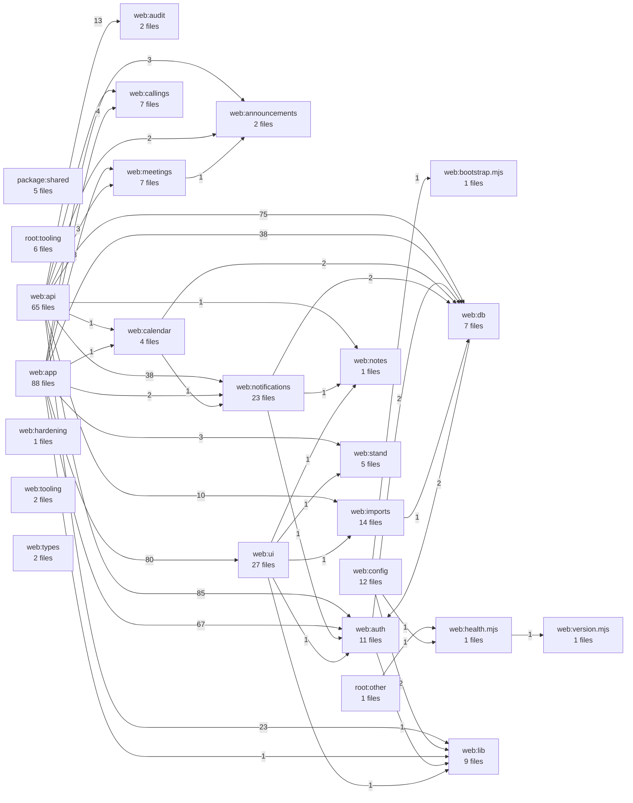

# Code Dependency Graph

> Generated by `npm run docs:dependencies`. Do not edit generated tables or diagrams by hand.

This index statically scans JavaScript and TypeScript imports. It groups files into architectural areas so the graph remains readable, while the file index preserves per-file dependency counts. Dynamic imports with non-literal paths, runtime database relationships, SQL dependencies, framework routing, and infrastructure configuration are outside its scope.

## Architectural graph

An arrow means that the source area imports the target area. Labels are the number of import statements (not necessarily unique files). Self-references are omitted from the diagram and retained in the table below.

## Area inventory

| Area | Source files |
| --- | ---: |
| `package:shared` | 5 |
| `root:other` | 1 |
| `root:tooling` | 6 |
| `web:announcements` | 2 |
| `web:api` | 65 |
| `web:app` | 88 |
| `web:audit` | 2 |
| `web:auth` | 11 |
| `web:bootstrap.mjs` | 1 |
| `web:calendar` | 4 |
| `web:callings` | 7 |
| `web:config` | 12 |
| `web:db` | 7 |
| `web:hardening` | 1 |
| `web:health.mjs` | 1 |
| `web:imports` | 14 |
| `web:lib` | 9 |
| `web:meetings` | 7 |
| `web:notes` | 1 |
| `web:notifications` | 23 |
| `web:stand` | 5 |
| `web:tooling` | 2 |
| `web:types` | 2 |
| `web:ui` | 27 |
| `web:version.mjs` | 1 |

## Internal dependencies

| Importing area | Imported area | Imports |
| --- | --- | ---: |
| `web:api` | `web:auth` | 85 |
| `web:app` | `web:ui` | 80 |
| `web:api` | `web:db` | 75 |
| `web:app` | `web:auth` | 67 |
| `web:api` | `web:notifications` | 38 |
| `web:app` | `web:db` | 38 |
| `web:app` | `web:app` | 37 |
| `web:notifications` | `web:notifications` | 32 |
| `web:ui` | `web:ui` | 24 |
| `web:api` | `web:lib` | 23 |
| `web:api` | `web:api` | 19 |
| `web:api` | `web:callings` | 15 |
| `web:api` | `web:audit` | 13 |
| `web:api` | `web:imports` | 10 |
| `web:imports` | `web:imports` | 9 |
| `web:app` | `web:meetings` | 8 |
| `web:auth` | `web:auth` | 8 |
| `web:app` | `web:callings` | 4 |
| `web:callings` | `web:callings` | 4 |
| `web:db` | `web:db` | 4 |
| `web:meetings` | `web:meetings` | 4 |
| `web:stand` | `web:stand` | 4 |
| `web:api` | `web:meetings` | 3 |
| `web:app` | `web:announcements` | 3 |
| `web:app` | `web:stand` | 3 |
| `web:calendar` | `web:calendar` | 3 |
| `web:lib` | `web:lib` | 3 |
| `package:shared` | `package:shared` | 2 |
| `web:api` | `web:announcements` | 2 |
| `web:app` | `web:notifications` | 2 |
| `web:auth` | `web:db` | 2 |
| `web:calendar` | `web:db` | 2 |
| `web:config` | `web:lib` | 2 |
| `web:db` | `web:auth` | 2 |
| `web:notifications` | `web:db` | 2 |
| `root:other` | `web:health.mjs` | 1 |
| `web:announcements` | `web:announcements` | 1 |
| `web:api` | `web:calendar` | 1 |
| `web:api` | `web:notes` | 1 |
| `web:app` | `web:calendar` | 1 |
| `web:app` | `web:lib` | 1 |
| `web:audit` | `web:audit` | 1 |
| `web:auth` | `web:lib` | 1 |
| `web:calendar` | `web:notifications` | 1 |
| `web:config` | `web:bootstrap.mjs` | 1 |
| `web:config` | `web:health.mjs` | 1 |
| `web:health.mjs` | `web:version.mjs` | 1 |
| `web:imports` | `web:db` | 1 |
| `web:meetings` | `web:announcements` | 1 |
| `web:notifications` | `web:auth` | 1 |
| `web:notifications` | `web:notes` | 1 |
| `web:ui` | `web:auth` | 1 |
| `web:ui` | `web:imports` | 1 |
| `web:ui` | `web:lib` | 1 |
| `web:ui` | `web:notes` | 1 |
| `web:ui` | `web:stand` | 1 |

## External dependencies

| Importing area | Package/runtime | Imports |
| --- | --- | ---: |
| `web:app` | `next` | 67 |
| `web:api` | `next` | 46 |
| `web:app` | `react` | 24 |
| `web:ui` | `react` | 24 |
| `web:api` | `vitest` | 18 |
| `root:tooling` | `Node.js` | 12 |
| `web:ui` | `next` | 11 |
| `web:notifications` | `vitest` | 9 |
| `web:notifications` | `pg` | 8 |
| `web:app` | `vitest` | 7 |
| `web:api` | `zod` | 6 |
| `web:auth` | `next-auth` | 6 |
| `web:imports` | `vitest` | 5 |
| `web:auth` | `vitest` | 4 |
| `web:tooling` | `Node.js` | 4 |
| `web:ui` | `next-auth` | 4 |
| `web:app` | `@testing-library/react` | 3 |
| `web:app` | `@testing-library/user-event` | 3 |
| `web:callings` | `vitest` | 3 |
| `web:db` | `drizzle-orm` | 3 |
| `web:db` | `vitest` | 3 |
| `web:lib` | `vitest` | 3 |
| `web:meetings` | `vitest` | 3 |
| `web:ui` | `@testing-library/react` | 3 |
| `web:ui` | `vitest` | 3 |
| `package:shared` | `vitest` | 2 |
| `root:other` | `Node.js` | 2 |
| `web:api` | `Node.js` | 2 |
| `web:api` | `pg` | 2 |
| `web:app` | `next-auth` | 2 |
| `web:calendar` | `vitest` | 2 |
| `web:callings` | `pg` | 2 |
| `web:config` | `@playwright/test` | 2 |
| `web:config` | `Node.js` | 2 |
| `web:db` | `Node.js` | 2 |
| `web:db` | `pg` | 2 |
| `web:hardening` | `Node.js` | 2 |
| `web:imports` | `Node.js` | 2 |
| `web:notifications` | `bullmq` | 2 |
| `web:stand` | `vitest` | 2 |
| `web:tooling` | `pg` | 2 |
| `package:shared` | `zod` | 1 |
| `web:announcements` | `vitest` | 1 |
| `web:api` | `@the-stand/shared` | 1 |
| `web:app` | `Node.js` | 1 |
| `web:app` | `next-themes` | 1 |
| `web:audit` | `pg` | 1 |
| `web:audit` | `vitest` | 1 |
| `web:auth` | `argon2` | 1 |
| `web:auth` | `next` | 1 |
| `web:bootstrap.mjs` | `Node.js` | 1 |
| `web:calendar` | `pg` | 1 |
| `web:config` | `@testing-library/jest-dom` | 1 |
| `web:config` | `child_process` | 1 |
| `web:config` | `drizzle-kit` | 1 |
| `web:config` | `fs` | 1 |
| `web:config` | `next` | 1 |
| `web:config` | `path` | 1 |
| `web:config` | `typescript-eslint` | 1 |
| `web:config` | `vitest` | 1 |
| `web:db` | `module` | 1 |
| `web:hardening` | `vitest` | 1 |
| `web:imports` | `@playwright/test` | 1 |
| `web:imports` | `pdf-parse` | 1 |
| `web:imports` | `playwright` | 1 |
| `web:lib` | `@sentry/nextjs` | 1 |
| `web:lib` | `jspdf` | 1 |
| `web:lib` | `qrcode` | 1 |
| `web:notifications` | `nodemailer` | 1 |
| `web:ui` | `class-variance-authority` | 1 |
| `web:ui` | `clsx` | 1 |
| `web:ui` | `next-themes` | 1 |
| `web:ui` | `tailwind-merge` | 1 |

## File index

| File | Area | Internal imports | External imports |
| --- | --- | ---: | ---: |
| `apps/web/app/account/change-password/change-password-form.tsx` | `web:app` | 0 | 1 |
| `apps/web/app/account/change-password/page.tsx` | `web:app` | 2 | 1 |
| `apps/web/app/account/page.tsx` | `web:app` | 5 | 2 |
| `apps/web/app/account/preferences/page.tsx` | `web:app` | 1 | 1 |
| `apps/web/app/account/preferences/theme-toggle.tsx` | `web:app` | 1 | 2 |
| `apps/web/app/announcements/announcements-workspace-client.tsx` | `web:app` | 3 | 2 |
| `apps/web/app/announcements/error.tsx` | `web:app` | 0 | 0 |
| `apps/web/app/announcements/loading.tsx` | `web:app` | 0 | 0 |
| `apps/web/app/announcements/page.tsx` | `web:app` | 7 | 2 |
| `apps/web/app/api/account/change-password/route.ts` | `web:api` | 4 | 1 |
| `apps/web/app/api/auth/[...nextauth]/route.ts` | `web:api` | 1 | 0 |
| `apps/web/app/api/health/route.ts` | `web:api` | 2 | 1 |
| `apps/web/app/api/hymns/route.ts` | `web:api` | 2 | 1 |
| `apps/web/app/api/me/route.ts` | `web:api` | 2 | 2 |
| `apps/web/app/api/public/access-requests/route.ts` | `web:api` | 2 | 2 |
| `apps/web/app/api/public/access-requests/route.vitest.ts` | `web:api` | 1 | 1 |
| `apps/web/app/api/sentry-example-api/route.ts` | `web:api` | 0 | 1 |
| `apps/web/app/api/standard-callings/[id]/route.ts` | `web:api` | 3 | 1 |
| `apps/web/app/api/standard-callings/route.ts` | `web:api` | 3 | 1 |
| `apps/web/app/api/support/access-requests/route.ts` | `web:api` | 3 | 1 |
| `apps/web/app/api/support/audit-log/route.ts` | `web:api` | 3 | 1 |
| `apps/web/app/api/support/hymns/[id]/route.ts` | `web:api` | 3 | 1 |
| `apps/web/app/api/support/hymns/route.ts` | `web:api` | 3 | 1 |
| `apps/web/app/api/w/[wardId]/announcements/[announcementId]/route.ts` | `web:api` | 6 | 1 |
| `apps/web/app/api/w/[wardId]/announcements/route.ts` | `web:api` | 9 | 1 |
| `apps/web/app/api/w/[wardId]/announcements/route.vitest.ts` | `web:api` | 1 | 1 |
| `apps/web/app/api/w/[wardId]/audit-log/route.ts` | `web:api` | 5 | 1 |
| `apps/web/app/api/w/[wardId]/calendar/refresh/route.ts` | `web:api` | 3 | 1 |
| `apps/web/app/api/w/[wardId]/calendar/route.ts` | `web:api` | 4 | 1 |
| `apps/web/app/api/w/[wardId]/callings/[callingId]/assign/route.ts` | `web:api` | 10 | 1 |
| `apps/web/app/api/w/[wardId]/callings/[callingId]/assign/route.vitest.ts` | `web:api` | 1 | 1 |
| `apps/web/app/api/w/[wardId]/callings/[callingId]/extend/route.ts` | `web:api` | 10 | 1 |
| `apps/web/app/api/w/[wardId]/callings/[callingId]/release/route.ts` | `web:api` | 10 | 1 |
| `apps/web/app/api/w/[wardId]/callings/[callingId]/route.ts` | `web:api` | 6 | 1 |
| `apps/web/app/api/w/[wardId]/callings/[callingId]/route.vitest.ts` | `web:api` | 1 | 1 |
| `apps/web/app/api/w/[wardId]/callings/[callingId]/set-apart/route.ts` | `web:api` | 9 | 1 |
| `apps/web/app/api/w/[wardId]/callings/[callingId]/set-apart/route.vitest.ts` | `web:api` | 1 | 1 |
| `apps/web/app/api/w/[wardId]/callings/[callingId]/sustain/route.ts` | `web:api` | 10 | 1 |
| `apps/web/app/api/w/[wardId]/callings/[callingId]/sustain/route.vitest.ts` | `web:api` | 1 | 1 |
| `apps/web/app/api/w/[wardId]/callings/route.ts` | `web:api` | 8 | 1 |
| `apps/web/app/api/w/[wardId]/callings/route.vitest.ts` | `web:api` | 1 | 1 |
| `apps/web/app/api/w/[wardId]/imports/callings/route.ts` | `web:api` | 12 | 2 |
| `apps/web/app/api/w/[wardId]/imports/callings/route.vitest.ts` | `web:api` | 1 | 1 |
| `apps/web/app/api/w/[wardId]/imports/lcr/[jobId]/route.ts` | `web:api` | 3 | 1 |
| `apps/web/app/api/w/[wardId]/imports/lcr/route.ts` | `web:api` | 8 | 2 |
| `apps/web/app/api/w/[wardId]/imports/membership/route.ts` | `web:api` | 11 | 1 |
| `apps/web/app/api/w/[wardId]/imports/membership/route.vitest.ts` | `web:api` | 1 | 1 |
| `apps/web/app/api/w/[wardId]/meetings/[meetingId]/business/[lineId]/route.ts` | `web:api` | 5 | 1 |
| `apps/web/app/api/w/[wardId]/meetings/[meetingId]/complete/route.ts` | `web:api` | 7 | 1 |
| `apps/web/app/api/w/[wardId]/meetings/[meetingId]/complete/route.vitest.ts` | `web:api` | 1 | 1 |
| `apps/web/app/api/w/[wardId]/meetings/[meetingId]/publish/route.ts` | `web:api` | 7 | 2 |
| `apps/web/app/api/w/[wardId]/meetings/[meetingId]/publish/route.vitest.ts` | `web:api` | 1 | 1 |
| `apps/web/app/api/w/[wardId]/meetings/[meetingId]/route.ts` | `web:api` | 9 | 1 |
| `apps/web/app/api/w/[wardId]/meetings/route.ts` | `web:api` | 8 | 1 |
| `apps/web/app/api/w/[wardId]/meetings/route.vitest.ts` | `web:api` | 1 | 1 |
| `apps/web/app/api/w/[wardId]/members/[memberId]/route.ts` | `web:api` | 5 | 1 |
| `apps/web/app/api/w/[wardId]/members/route.ts` | `web:api` | 5 | 1 |
| `apps/web/app/api/w/[wardId]/members/route.vitest.ts` | `web:api` | 1 | 1 |
| `apps/web/app/api/w/[wardId]/notes/[noteId]/route.ts` | `web:api` | 7 | 2 |
| `apps/web/app/api/w/[wardId]/notes/route.ts` | `web:api` | 8 | 2 |
| `apps/web/app/api/w/[wardId]/notes/route.vitest.ts` | `web:api` | 2 | 1 |
| `apps/web/app/api/w/[wardId]/notification-subscriptions/route.ts` | `web:api` | 7 | 2 |
| `apps/web/app/api/w/[wardId]/notification-subscriptions/route.vitest.ts` | `web:api` | 1 | 1 |
| `apps/web/app/api/w/[wardId]/notifications/[notificationId]/route.ts` | `web:api` | 5 | 2 |
| `apps/web/app/api/w/[wardId]/notifications/[notificationId]/route.vitest.ts` | `web:api` | 1 | 1 |
| `apps/web/app/api/w/[wardId]/notifications/diagnostics/route.ts` | `web:api` | 5 | 1 |
| `apps/web/app/api/w/[wardId]/notifications/mark-all-read/route.ts` | `web:api` | 5 | 1 |
| `apps/web/app/api/w/[wardId]/notifications/mark-all-read/route.vitest.ts` | `web:api` | 1 | 1 |
| `apps/web/app/api/w/[wardId]/notifications/route.ts` | `web:api` | 6 | 2 |
| `apps/web/app/api/w/[wardId]/notifications/route.vitest.ts` | `web:api` | 1 | 1 |
| `apps/web/app/api/w/[wardId]/portal/route.ts` | `web:api` | 4 | 2 |
| `apps/web/app/api/w/[wardId]/users/[userId]/roles/[roleId]/route.ts` | `web:api` | 7 | 1 |
| `apps/web/app/api/w/[wardId]/users/[userId]/roles/route.ts` | `web:api` | 7 | 1 |
| `apps/web/app/api/w/[wardId]/users/route.ts` | `web:api` | 4 | 1 |
| `apps/web/app/callings/error.tsx` | `web:app` | 0 | 0 |
| `apps/web/app/callings/loading.tsx` | `web:app` | 0 | 0 |
| `apps/web/app/callings/page.tsx` | `web:app` | 14 | 3 |
| `apps/web/app/callings/standard/page.tsx` | `web:app` | 4 | 2 |
| `apps/web/app/dashboard/error.tsx` | `web:app` | 0 | 0 |
| `apps/web/app/dashboard/loading.tsx` | `web:app` | 0 | 0 |
| `apps/web/app/dashboard/page.tsx` | `web:app` | 6 | 1 |
| `apps/web/app/global-error.tsx` | `web:app` | 1 | 1 |
| `apps/web/app/health/route.ts` | `web:app` | 1 | 1 |
| `apps/web/app/health/route.vitest.ts` | `web:app` | 1 | 1 |
| `apps/web/app/imports/callings/calling-import-client.tsx` | `web:app` | 2 | 1 |
| `apps/web/app/imports/callings/page.tsx` | `web:app` | 7 | 2 |
| `apps/web/app/imports/error.tsx` | `web:app` | 0 | 0 |
| `apps/web/app/imports/loading.tsx` | `web:app` | 0 | 0 |
| `apps/web/app/imports/members/member-import-client.tsx` | `web:app` | 2 | 1 |
| `apps/web/app/imports/members/page.tsx` | `web:app` | 5 | 2 |
| `apps/web/app/imports/membership-imports-client.tsx` | `web:app` | 0 | 0 |
| `apps/web/app/imports/page.tsx` | `web:app` | 4 | 2 |
| `apps/web/app/layout.tsx` | `web:app` | 6 | 1 |
| `apps/web/app/login/login-form.tsx` | `web:app` | 2 | 2 |
| `apps/web/app/login/page.tsx` | `web:app` | 2 | 1 |
| `apps/web/app/logout/logout-form.tsx` | `web:app` | 2 | 2 |
| `apps/web/app/logout/page.tsx` | `web:app` | 2 | 0 |
| `apps/web/app/meetings/[meetingId]/edit/page.tsx` | `web:app` | 10 | 2 |
| `apps/web/app/meetings/[meetingId]/print/page.tsx` | `web:app` | 6 | 1 |
| `apps/web/app/meetings/delete-meeting-button.tsx` | `web:app` | 1 | 2 |
| `apps/web/app/meetings/error.tsx` | `web:app` | 0 | 0 |
| `apps/web/app/meetings/loading.tsx` | `web:app` | 0 | 0 |
| `apps/web/app/meetings/meeting-form.tsx` | `web:app` | 9 | 2 |
| `apps/web/app/meetings/new/page.tsx` | `web:app` | 3 | 1 |
| `apps/web/app/meetings/page.tsx` | `web:app` | 8 | 2 |
| `apps/web/app/members/members-manager-client.tsx` | `web:app` | 3 | 2 |
| `apps/web/app/members/page.tsx` | `web:app` | 7 | 2 |
| `apps/web/app/notifications/error.tsx` | `web:app` | 0 | 0 |
| `apps/web/app/notifications/loading.tsx` | `web:app` | 0 | 0 |
| `apps/web/app/notifications/notification-center.tsx` | `web:app` | 1 | 1 |
| `apps/web/app/notifications/notification-center.vitest.tsx` | `web:app` | 1 | 4 |
| `apps/web/app/notifications/page.tsx` | `web:app` | 3 | 1 |
| `apps/web/app/p/[meetingToken]/route.ts` | `web:app` | 1 | 1 |
| `apps/web/app/p/[meetingToken]/route.vitest.ts` | `web:app` | 1 | 1 |
| `apps/web/app/p/ward/[portalToken]/route.ts` | `web:app` | 1 | 1 |
| `apps/web/app/p/ward/[portalToken]/route.vitest.ts` | `web:app` | 1 | 1 |
| `apps/web/app/page.tsx` | `web:app` | 4 | 1 |
| `apps/web/app/reports/page.tsx` | `web:app` | 4 | 1 |
| `apps/web/app/request-access/page.tsx` | `web:app` | 1 | 0 |
| `apps/web/app/request-access/request-access-form.tsx` | `web:app` | 2 | 1 |
| `apps/web/app/sentry-example-page/page.tsx` | `web:app` | 0 | 0 |
| `apps/web/app/settings/audit-log/WardAuditLogClient.tsx` | `web:app` | 1 | 1 |
| `apps/web/app/settings/audit-log/page.tsx` | `web:app` | 8 | 2 |
| `apps/web/app/settings/notification-timezone.tsx` | `web:app` | 0 | 1 |
| `apps/web/app/settings/notification-timezone.vitest.tsx` | `web:app` | 1 | 4 |
| `apps/web/app/settings/notifications/notification-subscription-settings.tsx` | `web:app` | 1 | 1 |
| `apps/web/app/settings/notifications/notification-subscription-settings.vitest.tsx` | `web:app` | 1 | 4 |
| `apps/web/app/settings/notifications/page.tsx` | `web:app` | 2 | 1 |
| `apps/web/app/settings/page.tsx` | `web:app` | 5 | 1 |
| `apps/web/app/settings/public-portal/error.tsx` | `web:app` | 0 | 0 |
| `apps/web/app/settings/public-portal/loading.tsx` | `web:app` | 0 | 0 |
| `apps/web/app/settings/public-portal/page.tsx` | `web:app` | 7 | 3 |
| `apps/web/app/settings/stand-script/error.tsx` | `web:app` | 0 | 0 |
| `apps/web/app/settings/stand-script/loading.tsx` | `web:app` | 0 | 0 |
| `apps/web/app/settings/stand-script/page.tsx` | `web:app` | 6 | 2 |
| `apps/web/app/settings/users/error.tsx` | `web:app` | 0 | 0 |
| `apps/web/app/settings/users/loading.tsx` | `web:app` | 0 | 0 |
| `apps/web/app/settings/users/page.tsx` | `web:app` | 3 | 2 |
| `apps/web/app/settings/users/ward-users-manager.tsx` | `web:app` | 2 | 1 |
| `apps/web/app/stand/[meetingId]/page.tsx` | `web:app` | 11 | 2 |
| `apps/web/app/support/access-requests/page.tsx` | `web:app` | 5 | 3 |
| `apps/web/app/support/audit-log/AuditLogViewer.tsx` | `web:app` | 1 | 1 |
| `apps/web/app/support/audit-log/page.tsx` | `web:app` | 7 | 2 |
| `apps/web/app/support/hymns/page.tsx` | `web:app` | 5 | 3 |
| `apps/web/app/support/page.tsx` | `web:app` | 4 | 2 |
| `apps/web/app/support/provisioning/StakeWardManager.tsx` | `web:app` | 2 | 1 |
| `apps/web/app/support/provisioning/actions.ts` | `web:app` | 3 | 2 |
| `apps/web/app/support/provisioning/page.tsx` | `web:app` | 7 | 2 |
| `apps/web/app/support/users/UserAdminManager.tsx` | `web:app` | 3 | 1 |
| `apps/web/app/support/users/actions.ts` | `web:app` | 4 | 2 |
| `apps/web/app/support/users/page.tsx` | `web:app` | 7 | 2 |
| `apps/web/app/support/users/support-grants.ts` | `web:app` | 0 | 0 |
| `apps/web/app/support/users/support-grants.vitest.ts` | `web:app` | 1 | 1 |
| `apps/web/components/AddCallingForm.tsx` | `web:ui` | 3 | 1 |
| `apps/web/components/AddCallingSection.tsx` | `web:ui` | 1 | 1 |
| `apps/web/components/CallingAssignButton.tsx` | `web:ui` | 1 | 2 |
| `apps/web/components/CallingDeleteButton.tsx` | `web:ui` | 1 | 2 |
| `apps/web/components/CallingReleaseButton.tsx` | `web:ui` | 1 | 2 |
| `apps/web/components/HymnAutocomplete.tsx` | `web:ui` | 0 | 1 |
| `apps/web/components/InternalNotesPanel.tsx` | `web:ui` | 2 | 1 |
| `apps/web/components/StandardCallingsManager.tsx` | `web:ui` | 1 | 2 |
| `apps/web/components/WardBusinessSection.tsx` | `web:ui` | 2 | 2 |
| `apps/web/components/WardBusinessSection.vitest.tsx` | `web:ui` | 1 | 3 |
| `apps/web/components/app-navigation.tsx` | `web:ui` | 1 | 0 |
| `apps/web/components/app-shell.tsx` | `web:ui` | 8 | 4 |
| `apps/web/components/auth-session-provider.tsx` | `web:ui` | 0 | 3 |
| `apps/web/components/auth-session-refresh.tsx` | `web:ui` | 0 | 3 |
| `apps/web/components/conducting-mode-context.tsx` | `web:ui` | 0 | 1 |
| `apps/web/components/deployment-watcher.tsx` | `web:ui` | 0 | 1 |
| `apps/web/components/lcr-extractor-instructions.tsx` | `web:ui` | 2 | 1 |
| `apps/web/components/notification-bell.tsx` | `web:ui` | 0 | 2 |
| `apps/web/components/notification-bell.vitest.tsx` | `web:ui` | 1 | 3 |
| `apps/web/components/public-portal/PublicLinkQrCard.tsx` | `web:ui` | 2 | 1 |
| `apps/web/components/site-logo.tsx` | `web:ui` | 0 | 2 |
| `apps/web/components/site-logo.vitest.tsx` | `web:ui` | 1 | 3 |
| `apps/web/components/theme-provider.tsx` | `web:ui` | 0 | 2 |
| `apps/web/components/ui/button.tsx` | `web:ui` | 1 | 2 |
| `apps/web/components/ui/calling-autocomplete.tsx` | `web:ui` | 0 | 1 |
| `apps/web/components/ui/member-autocomplete.tsx` | `web:ui` | 0 | 1 |
| `apps/web/drizzle.config.ts` | `web:config` | 0 | 1 |
| `apps/web/e2e/acceptance.spec.ts` | `web:config` | 0 | 1 |
| `apps/web/eslint.config.mjs` | `web:config` | 0 | 1 |
| `apps/web/instrumentation-client.ts` | `web:config` | 1 | 0 |
| `apps/web/instrumentation.ts` | `web:config` | 1 | 0 |
| `apps/web/lib/utils.ts` | `web:ui` | 0 | 2 |
| `apps/web/next-env.d.ts` | `web:config` | 0 | 0 |
| `apps/web/next.config.ts` | `web:config` | 0 | 4 |
| `apps/web/playwright.config.ts` | `web:config` | 0 | 1 |
| `apps/web/postcss.config.mjs` | `web:config` | 0 | 0 |
| `apps/web/scripts/migrate.mjs` | `web:tooling` | 0 | 3 |
| `apps/web/scripts/migrate.ts` | `web:tooling` | 0 | 3 |
| `apps/web/server.mjs` | `web:config` | 2 | 1 |
| `apps/web/src/announcements/types.ts` | `web:announcements` | 0 | 0 |
| `apps/web/src/announcements/types.vitest.ts` | `web:announcements` | 1 | 1 |
| `apps/web/src/audit/service.ts` | `web:audit` | 0 | 1 |
| `apps/web/src/audit/service.vitest.ts` | `web:audit` | 1 | 1 |
| `apps/web/src/auth/auth.ts` | `web:auth` | 5 | 3 |
| `apps/web/src/auth/guards.ts` | `web:auth` | 1 | 2 |
| `apps/web/src/auth/navigation.ts` | `web:auth` | 1 | 0 |
| `apps/web/src/auth/navigation.vitest.ts` | `web:auth` | 1 | 1 |
| `apps/web/src/auth/password.ts` | `web:auth` | 0 | 1 |
| `apps/web/src/auth/password.vitest.ts` | `web:auth` | 1 | 1 |
| `apps/web/src/auth/roles.ts` | `web:auth` | 0 | 0 |
| `apps/web/src/auth/roles.vitest.ts` | `web:auth` | 1 | 1 |
| `apps/web/src/auth/support-access.ts` | `web:auth` | 0 | 0 |
| `apps/web/src/auth/support-access.vitest.ts` | `web:auth` | 1 | 1 |
| `apps/web/src/auth/types.d.ts` | `web:auth` | 0 | 2 |
| `apps/web/src/bootstrap.mjs` | `web:bootstrap.mjs` | 0 | 1 |
| `apps/web/src/calendar/ics.ts` | `web:calendar` | 0 | 0 |
| `apps/web/src/calendar/ics.vitest.ts` | `web:calendar` | 1 | 1 |
| `apps/web/src/calendar/service.ts` | `web:calendar` | 4 | 1 |
| `apps/web/src/calendar/service.vitest.ts` | `web:calendar` | 1 | 1 |
| `apps/web/src/callings/lifecycle.ts` | `web:callings` | 0 | 0 |
| `apps/web/src/callings/lifecycle.vitest.ts` | `web:callings` | 1 | 1 |
| `apps/web/src/callings/meeting-business.ts` | `web:callings` | 0 | 1 |
| `apps/web/src/callings/meeting-business.vitest.ts` | `web:callings` | 1 | 1 |
| `apps/web/src/callings/standard-callings.ts` | `web:callings` | 0 | 0 |
| `apps/web/src/callings/transition.ts` | `web:callings` | 1 | 1 |
| `apps/web/src/callings/transition.vitest.ts` | `web:callings` | 1 | 1 |
| `apps/web/src/db/bootstrap-support-admin.ts` | `web:db` | 3 | 1 |
| `apps/web/src/db/bootstrap-support-admin.vitest.ts` | `web:db` | 1 | 1 |
| `apps/web/src/db/client.ts` | `web:db` | 1 | 4 |
| `apps/web/src/db/context.ts` | `web:db` | 0 | 0 |
| `apps/web/src/db/context.vitest.ts` | `web:db` | 1 | 1 |
| `apps/web/src/db/schema.ts` | `web:db` | 0 | 2 |
| `apps/web/src/db/ward-user-role-rls.vitest.ts` | `web:db` | 0 | 2 |
| `apps/web/src/hardening/production-readiness.vitest.ts` | `web:hardening` | 0 | 3 |
| `apps/web/src/health.mjs` | `web:health.mjs` | 1 | 0 |
| `apps/web/src/imports/bookmarklet.ts` | `web:imports` | 0 | 0 |
| `apps/web/src/imports/bookmarklet.vitest.ts` | `web:imports` | 1 | 1 |
| `apps/web/src/imports/callings.ts` | `web:imports` | 1 | 0 |
| `apps/web/src/imports/callings.vitest.ts` | `web:imports` | 1 | 1 |
| `apps/web/src/imports/lcr-jobs.ts` | `web:imports` | 0 | 1 |
| `apps/web/src/imports/lcr.ts` | `web:imports` | 2 | 2 |
| `apps/web/src/imports/lcr.vitest.ts` | `web:imports` | 1 | 1 |
| `apps/web/src/imports/member-identity.ts` | `web:imports` | 0 | 1 |
| `apps/web/src/imports/member-identity.vitest.ts` | `web:imports` | 1 | 1 |
| `apps/web/src/imports/membership.ts` | `web:imports` | 1 | 0 |
| `apps/web/src/imports/membership.vitest.ts` | `web:imports` | 1 | 1 |
| `apps/web/src/imports/pdf-cleanup.ts` | `web:imports` | 0 | 0 |
| `apps/web/src/imports/pdf.ts` | `web:imports` | 0 | 1 |
| `apps/web/src/imports/purge.ts` | `web:imports` | 1 | 0 |
| `apps/web/src/lib/logger.ts` | `web:lib` | 0 | 0 |
| `apps/web/src/lib/qr-pdf.ts` | `web:lib` | 0 | 2 |
| `apps/web/src/lib/qr-pdf.vitest.ts` | `web:lib` | 1 | 1 |
| `apps/web/src/lib/rate-limit.ts` | `web:lib` | 0 | 0 |
| `apps/web/src/lib/rate-limit.vitest.ts` | `web:lib` | 1 | 1 |
| `apps/web/src/lib/sentry-nextjs-noop.ts` | `web:lib` | 0 | 0 |
| `apps/web/src/lib/sentry.ts` | `web:lib` | 0 | 1 |
| `apps/web/src/lib/version.ts` | `web:lib` | 0 | 0 |
| `apps/web/src/lib/version.vitest.ts` | `web:lib` | 1 | 1 |
| `apps/web/src/meetings/date.ts` | `web:meetings` | 0 | 0 |
| `apps/web/src/meetings/date.vitest.ts` | `web:meetings` | 1 | 1 |
| `apps/web/src/meetings/default-program.ts` | `web:meetings` | 1 | 0 |
| `apps/web/src/meetings/default-program.vitest.ts` | `web:meetings` | 1 | 1 |
| `apps/web/src/meetings/render.ts` | `web:meetings` | 1 | 0 |
| `apps/web/src/meetings/render.vitest.ts` | `web:meetings` | 1 | 1 |
| `apps/web/src/meetings/types.ts` | `web:meetings` | 0 | 0 |
| `apps/web/src/notes/types.ts` | `web:notes` | 0 | 0 |
| `apps/web/src/notifications/diagnostics.ts` | `web:notifications` | 0 | 1 |
| `apps/web/src/notifications/digests.ts` | `web:notifications` | 2 | 1 |
| `apps/web/src/notifications/email-preferences.ts` | `web:notifications` | 0 | 1 |
| `apps/web/src/notifications/email-preferences.vitest.ts` | `web:notifications` | 1 | 1 |
| `apps/web/src/notifications/email.ts` | `web:notifications` | 3 | 1 |
| `apps/web/src/notifications/email.vitest.ts` | `web:notifications` | 1 | 1 |
| `apps/web/src/notifications/events.ts` | `web:notifications` | 0 | 0 |
| `apps/web/src/notifications/events.vitest.ts` | `web:notifications` | 1 | 1 |
| `apps/web/src/notifications/format.ts` | `web:notifications` | 2 | 0 |
| `apps/web/src/notifications/format.vitest.ts` | `web:notifications` | 1 | 1 |
| `apps/web/src/notifications/outbox.ts` | `web:notifications` | 1 | 1 |
| `apps/web/src/notifications/queue.ts` | `web:notifications` | 1 | 1 |
| `apps/web/src/notifications/recipients.ts` | `web:notifications` | 2 | 1 |
| `apps/web/src/notifications/recipients.vitest.ts` | `web:notifications` | 1 | 1 |
| `apps/web/src/notifications/runner.ts` | `web:notifications` | 8 | 1 |
| `apps/web/src/notifications/runner.vitest.ts` | `web:notifications` | 1 | 1 |
| `apps/web/src/notifications/subscriptions.ts` | `web:notifications` | 1 | 1 |
| `apps/web/src/notifications/subscriptions.vitest.ts` | `web:notifications` | 1 | 1 |
| `apps/web/src/notifications/user-notifications.ts` | `web:notifications` | 1 | 1 |
| `apps/web/src/notifications/user-notifications.vitest.ts` | `web:notifications` | 1 | 1 |
| `apps/web/src/notifications/visibility.ts` | `web:notifications` | 1 | 0 |
| `apps/web/src/notifications/visibility.vitest.ts` | `web:notifications` | 1 | 1 |
| `apps/web/src/notifications/worker-entry.ts` | `web:notifications` | 5 | 1 |
| `apps/web/src/stand/default-template.ts` | `web:stand` | 0 | 0 |
| `apps/web/src/stand/member-display.ts` | `web:stand` | 0 | 0 |
| `apps/web/src/stand/member-display.vitest.ts` | `web:stand` | 1 | 1 |
| `apps/web/src/stand/render.ts` | `web:stand` | 2 | 0 |
| `apps/web/src/stand/render.vitest.ts` | `web:stand` | 1 | 1 |
| `apps/web/src/types/external-modules.d.ts` | `web:types` | 0 | 0 |
| `apps/web/src/types/pg.d.ts` | `web:types` | 0 | 0 |
| `apps/web/src/version.mjs` | `web:version.mjs` | 0 | 0 |
| `apps/web/test/setup.ts` | `web:config` | 0 | 1 |
| `apps/web/vitest.config.ts` | `web:config` | 0 | 2 |
| `health.test.js` | `root:other` | 1 | 2 |
| `packages/shared/eslint.config.js` | `package:shared` | 0 | 0 |
| `packages/shared/src/index.mjs` | `package:shared` | 1 | 0 |
| `packages/shared/src/index.ts` | `package:shared` | 0 | 1 |
| `packages/shared/src/index.vitest.ts` | `package:shared` | 1 | 1 |
| `packages/shared/vitest.config.ts` | `package:shared` | 0 | 1 |
| `scripts/build.mjs` | `root:tooling` | 0 | 1 |
| `scripts/dependency-graph.mjs` | `root:tooling` | 0 | 5 |
| `scripts/lint.mjs` | `root:tooling` | 0 | 1 |
| `scripts/next-build.mjs` | `root:tooling` | 0 | 2 |
| `scripts/typecheck.mjs` | `root:tooling` | 0 | 0 |
| `scripts/vitest.mjs` | `root:tooling` | 0 | 3 |

## Regenerating and validating

- Run `npm run docs:dependencies` after changing module imports or adding source files.
- Run `npm run docs:dependencies:check` in CI or locally to fail when this document is stale.
- Review new cross-area edges carefully, especially dependencies that bypass the authentication, ward-context, or database layers.
